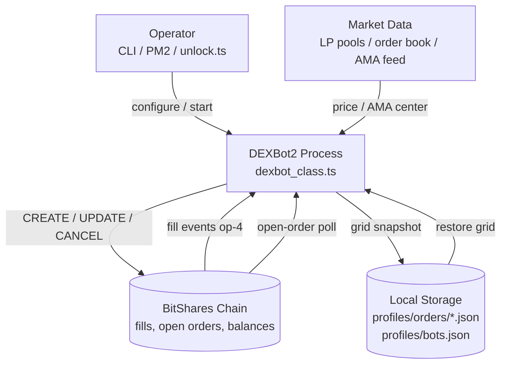
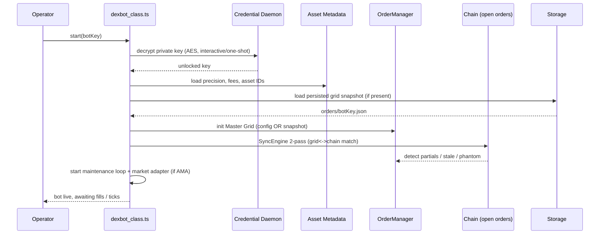
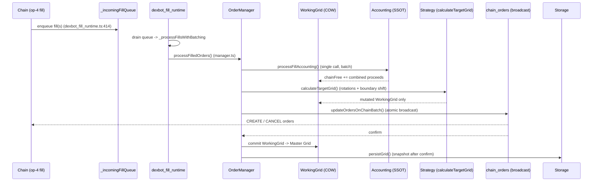
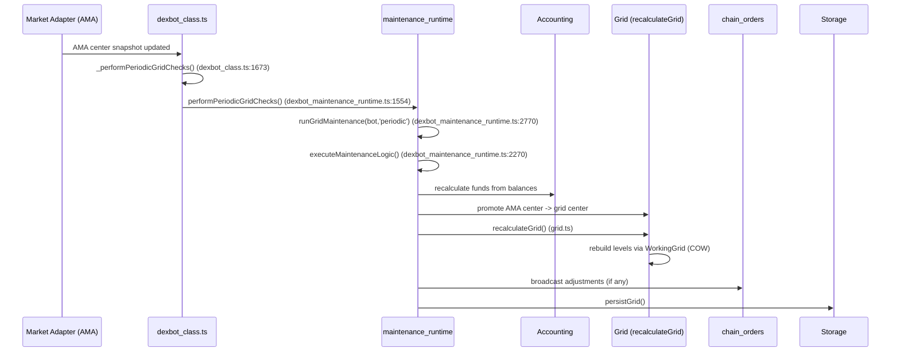

# DEXBot2 Lifecycle — End-to-End Walkthrough

This is the **one-page map** for newcomers. It stitches together the flows that are
otherwise spread across `architecture.md` and `developer_guide.md` into two concrete
lifecycles (fill-driven and maintenance-driven) plus the startup sequence. Read this
first; follow the file/function references into the deeper docs.

> All code references use `file:line` so you can jump straight to the source.

---

## 1. System Context

Who talks to what. DEXBot2 is a long-running Node process that both *reads* the
BitShares chain/market and *writes* limit orders back to it.

Three inputs drive everything: **fill events** (reactive), **market/AMA price**
(periodic), and **config/storage** (startup + recovery).

---

## 2. Startup / Bootstrap Sequence

Runs once per bot launch. Goal: decrypt keys, load metadata, rebuild the master
grid from either config or the persisted snapshot, then hand off to the runtime
loops.

Key references:
- Credential unlock: `modules/credential_runtime.ts`, `CREDENTIAL_SECURITY.md`
- Master Grid init + COW: `docs/architecture.md` §"Copy-on-Write (COW) Grid Pattern"
- SyncEngine 2-pass: `modules/order/sync_engine.ts`, `docs/GRID_RECONCILE.md`

---

## 3. Lifecycle A — Fill-Driven (Reactive)

This is the hot path. A limit order gets filled on-chain and the bot must rebuild
grid symmetry, credit proceeds, and broadcast replacement orders — all inside a
single Copy-on-Write rebalance cycle.

Why it matters:
- **Gap-slot batching** (batch size = grid gap-slot count + 1, `DEXBot._getGapSlotBatchSize`) keeps bursts
  deterministic — see `docs/architecture.md` §"Fill Processing Pipeline".
- **Single rebalance cycle**: all fills in a batch share one broadcast, so proceeds
  are immediately available for replacement sizing (no split-across-cycles delay).
- **Replay-safe accounting**: processed-fill keys prevent double-credit on retries
  (`modules/dexbot_fill_runtime.ts`, `PROCESSED_FILL_PERSISTENCE_MODES`).

References: `modules/dexbot_fill_runtime.ts`, `modules/order/manager.ts`,
`docs/FUND_MOVEMENT_AND_ACCOUNTING.md`.

---

## 4. Lifecycle B — Maintenance / AMA Signal-Driven (Periodic)

Runs on a timer (and on AMA center updates). The grid is *not* rebuilt from fills
here; instead funds are re-synced, the AMA center is promoted to the grid center,
and the grid is recalculated against the latest market view.

Two triggers feed this loop:
1. **Timer** — periodic fund sync + grid checks (`_performPeriodicGridChecks`).
2. **AMA center change** — `market_adapter` recomputes the adaptive moving average;
   when the center moves enough it promotes to the grid center and forces a recalc
   (`modules/dexbot_maintenance_runtime.ts`, `market_adapter/market_adapter.ts`).

The AMA signal stack (AMA/Kalman/Hurst/PE) is *research-tuned* in `analysis/` and
*consumed* here at runtime — see `analysis/README.md` for the tooling that produces
the parameters.

> Note: `runMaintenance()` is a **different** subsystem — the credit/MPA debt
> runtime (`modules/credit_runtime.ts:3019`, reached via
> `_runCreditRuntimeMaintenance` at `dexbot_class.ts:1790`). The grid maintenance
> chain above is the one that matters for order/price upkeep.

References: `modules/dexbot_class.ts:1673` (`_performPeriodicGridChecks`) →
`modules/dexbot_maintenance_runtime.ts:1554` (`performPeriodicGridChecks`) →
`:1845` (`runGridMaintenance`) → `:1452` (`executeMaintenanceLogic`),
`docs/GRID_RECALCULATION.md`, `docs/GRID_RECONCILE.md`.

---

## 5. Cross-Cutting Invariants (read before touching anything)

These are the rules that make the two lifecycles safe. They are *convention-
enforced*, not compiler-enforced — learn them or you will introduce fund bugs.

| Invariant | Rule | Reference |
|---|---|---|
| **COW boundary** | All grid mutations happen on the WorkingGrid; Master Grid is frozen and only committed after chain confirmation. | `docs/developer_guide.md` §"Copy-on-Write (COW) Development Rules" |
| **Fund SSOT** | `Accounting` owns every fund number. Nothing else computes available funds. | `docs/architecture.md` §"Fund Flow Architecture" |
| **Replay-safe fills** | A fill is credited exactly once via processed-fill keys; retries are idempotent. | `modules/dexbot_fill_runtime.ts` |
| **Single broadcast per cycle** | One `updateOrdersOnChainBatch` per rebalance — never scatter writes. | `docs/architecture.md` §"Fill Processing Pipeline" |
| **Slot price = genesis level** | Every emitted order's price must equal `priceForSlot(idx, genesis)` for its slot — range guards cannot substitute for grid membership; off-grid emissions are blocked. | `docs/GRID_PRICE_INVARIANT.md` |
| **Browser/Node split** | Heavy runtime is Node-only; never import it from a browser bundle. | `AGENTS.md` "Browser-Safe Surface", `package.json` "browser" field |
| **Lock ordering** | Fill drain and maintenance must not run a rebalance concurrently. | `docs/developer_guide.md` §"Startup Sequence & Lock Ordering" |

---

## 6. File Map (where to go next)

| You want to understand… | Start here |
|---|---|
| How a fill becomes orders | `modules/dexbot_fill_runtime.ts` → `modules/order/manager.ts` |
| Grid math / recalculation | `modules/order/grid.ts`, `docs/GRID_RECALCULATION.md` |
| Funds & accounting | `modules/order/accounting.ts`, `docs/FUND_MOVEMENT_AND_ACCOUNTING.md` |
| Periodic loop & AMA hook | `modules/dexbot_maintenance_runtime.ts`, `modules/dexbot_class.ts:1673` |
| Market signal source | `market_adapter/market_adapter.ts`, `analysis/README.md` |
| Startup & orchestration | `modules/dexbot_class.ts`, `docs/developer_guide.md` §"Startup Sequence" |
| Why COW exists | `docs/architecture.md` §"Copy-on-Write (COW) Grid Pattern", `docs/COW_INVARIANTS.md` |

---

### TL;DR mental model

> Blockchain fill (or AMA tick) → enqueue → drain in fixed-cap batches →
> credit proceeds to Accounting (SSOT) → mutate **WorkingGrid** only →
> calculate target grid → **single** atomic broadcast → commit WorkingGrid to
> Master → persist snapshot. Master Grid is immutable; everything else is a
> disposable copy until the chain confirms.
