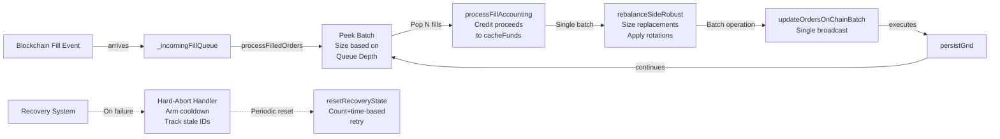

# Documentation Update Analysis for Patch17 & Patch18

**Generated**: Feb 8, 2026  
**Scope**: Identifies all documentation files requiring updates based on patch17 (Adaptive Fill Batching) and patch18 (Batching Hardening).

---

## Executive Summary

Two patches address critical production issues discovered during Feb 7 market crash:

- **Patch 17** (Feb 7): Fixes fill processing bottleneck, recovery lockup, orphan double-credit, and logging precision
- **Patch 18** (Feb 8): Hardens patch 17 with cache accuracy, cooldown guards, and stale-order speed improvements

**Impact Level**: HIGH - Affects core fill pipeline, fund accounting, strategy engine, and production stability.

**Files Requiring Updates**: 6 primary + 2 secondary  
**Estimated Effort**: 4-6 hours for complete updates

---

## Files Requiring Updates

### 🔴 HIGH PRIORITY (Core Systems)

#### 1. **developer_guide.md**
**Priority**: CRITICAL  
**Current Status**: Outdated relative to patch17/18 features

**Sections Needing Updates**:

| Section | Current Content | Required Update | Patch | Reason |
|---------|-----------------|-----------------|-------|--------|
| **Glossary: Order States** (lines 39-50) | Lists basic states without pipeline context | Add Pipeline Safety Features subsection with patch12 timeout info | P12 ref | Already has reference, but needs link consolidation |
| **Glossary: Pipeline Safety** (lines 52-58) | Limited to patch12 features | **ADD**: Fill Processing Batching (patch17), Recovery Retry System (patch17), Stale-Order Handling (patch18), Cooldown Consistency (patch18) | P17,P18 | Core new features |
| **Glossary: Operations** (lines 87-97) | Missing batch-related terminology | **ADD**: Batch Processing, Adaptive Batch Sizing, Stale-Order Recovery, Orphan-Fill Deduplication | P17,P18 | New operational concepts |
| **Code Reading Roadmap** (lines 24-33) | No mention of fill pipeline or strategy recovery | **ADD**: Step for `modules/order/accounting.js::resetRecoveryState()` and batch processing in strategy | P17 | New recovery mechanism |

**Specific Changes Required**:
```markdown
# BEFORE (lines 52-58)
### Pipeline Safety Features (Patch 12)
| Term | Meaning |
|------|---------|
| **Pipeline Timeout Safeguard** | 5-minute timeout ... |
| **Pipeline Health Diagnostics** | getPipelineHealth() method ... |
| **Stale Operation Clearing** | Non-destructive recovery ... |

# AFTER (expanded)
### Pipeline Safety Features

#### Patch 12 (Pipeline Timeout & Health)
| Term | Meaning |
|------|---------|
| **Pipeline Timeout Safeguard** | 5-minute timeout on isPipelineEmpty() ... |
| **Pipeline Health Diagnostics** | getPipelineHealth() method with 8 diagnostic fields ... |
| **Stale Operation Clearing** | Non-destructive recovery clearing operation flags ... |

#### Patch 17 (Fill Batching & Recovery Retries)
| Term | Meaning |
|------|---------|
| **Adaptive Batch Fill Processing** | Groups fills into stress-scaled batches (1-4 per broadcast based on queue depth) to reduce market divergence window |
| **Batch Stress Tiers** | Configurable `BATCH_STRESS_TIERS` array mapping queue depth to batch size |
| **Recovery Retry System** | Count+time-based retry mechanism (max 5 attempts, 60s interval) replacing one-shot `_recoveryAttempted` flag |
| **Orphan-Fill Deduplication** | Map+TTL-based tracking of stale-cleaned order IDs to prevent double-credit |

#### Patch 18 (Batching Hardening)
| Term | Meaning |
|------|---------|
| **Cache Remainder Tracking** | Cache remainder now derived from actual allocated sizes during capped grid resizes |
| **Stale-Order Fast-Path** | Stale-cancel logic applied to single-op batches for fast recovery without full sync |
```

**Files to Reference**:
- `modules/dexbot_class.js::processFilledOrders()` - Fill batch processing entry point
- `modules/order/accounting.js::resetRecoveryState()` - Recovery state management
- `modules/constants.js` - FILL_PROCESSING, PIPELINE_TIMING configs

---

#### 2. **FUND_MOVEMENT_AND_ACCOUNTING.md**
**Priority**: CRITICAL  
**Current Status**: Missing patch17/18 fund flow details

**Sections Needing Updates**:

| Section | Current Content | Required Update | Patch | Reason |
|---------|-----------------|-----------------|-------|--------|
| **1.1 Fund Components** (lines 7-17) | No mention of fill batch processing impact | **ADD**: CacheFunds update mechanism during batch fills; fee reservation for batch operations | P17 | Cache funds now credited per-batch, not per-fill |
| **1.2 Available Funds Formula** (lines 19-27) | Formula unchanged but context outdated | **ENHANCE**: Note that formula applies per-batch, with recovery retry implications | P17,P18 | Batch sizing affects available calculation |
| **NEW SECTION NEEDED**: Fill Batch Processing Flow | Missing entirely | **CREATE**: Section 1.4 "Fill Batch Processing & Fund Crediting" with subsections: Batch Queue Depth, Adaptive Sizing, Cache Fund Timeline, Recovery Retry Points | P17,P18 | Core fund flow during fills |
| **NEW SECTION NEEDED**: Orphan-Fill Prevention | Missing entirely | **CREATE**: Section 3.7 "Orphan-Fill Deduplication & Double-Credit Prevention" documenting stale-cleaned order tracking | P17 | Critical safety mechanism |
| **3.2 Global Side Capping** (lines 145-150) | No batch-related capping mention | **ADD**: Note that batch sizing capping applies during fill rebalance, not just grid creation | P18 | Cache remainder affects side capping |

**Specific Changes Required**:

```markdown
# ADD NEW SECTION after 1.2

## 1.4 Fill Batch Processing & Cache Fund Timeline (Patch 17)

### Problem Solved
Previously, fills were processed one-at-a-time (~3s per broadcast). A burst of 29 fills took ~90s, during which:
- Market prices moved significantly
- Orders became stale
- Orphan fills were created
- Fund tracking diverged

### Solution: Adaptive Batch Fill Processing

**Mechanism**: `processFilledOrders()` groups fills into stress-scaled batches before broadcasting replacement orders.

**Batch Sizing Algorithm**:
```javascript
// Batch size based on queue depth
const batchSize = BATCH_STRESS_TIERS.find(tier => queueDepth >= tier[0])?.[1] || 1;
// Example tiers: [[0,1], [3,2], [8,3], [15,4]]
// queueDepth=5 → batchSize=2, queueDepth=20 → batchSize=4
```

**Timeline**:
1. Fills arrive in `_incomingFillQueue`
2. `processFilledOrders()` pops batch (up to `MAX_FILL_BATCH_SIZE`, default 4)
3. Single `processFillAccounting()` call credits all proceeds to `cacheFunds`
4. Single `rebalanceSideRobust()` call sizes replacement orders
5. All orders broadcast in single batch operation
6. Pipeline continues with next batch

**Impact**: 29 fills now processed in ~8 broadcasts (~24s) instead of 29 (~90s).

### Cache Fund Crediting

Fill proceeds are added to `cacheFunds`:
```
cacheFunds += proceeds[fill1] + proceeds[fill2] + ... + proceeds[fillN]
```

All proceeds are available in the same rebalance cycle (not split across cycles).

### Recovery Retry System (Patch 17)

**Previous behavior**: One-shot `_recoveryAttempted` boolean flag meant permanent lockup if recovery failed once.

**New behavior**: Count+time-based retry system with periodic reset.

**Configuration** (`modules/constants.js`):
```javascript
PIPELINE_TIMING: {
  RECOVERY_RETRY_INTERVAL_MS: 60000,  // Min 60s between retry attempts
  MAX_RECOVERY_ATTEMPTS: 5,           // Max 5 retries per episode (0 = unlimited)
}
```

**Reset Points** (Called by `resetRecoveryState()` in `accounting.js`):
1. **Fill-triggered**: `processFilledOrders()` resets recovery state when fills arrive
2. **Periodic**: Blockchain fetch loop resets recovery state every 10 minutes

**Impact**: If recovery fails, bot retries every 60s instead of requiring manual restart. Self-heals within minutes after market settles.
```

# ADD NEW SECTION after 3.6

## 3.7 Orphan-Fill Deduplication & Double-Credit Prevention (Patch 17)

### Problem Solved

During Feb 7 market crash, stale-order batch failures cascaded into double-crediting:

1. Batch contains filled order (on-chain between sync and broadcast)
2. Batch execution fails: "Limit order X does not exist" 
3. Error handler cleans up: releases slot, frees funds to `chainFree`
4. **Orphan fill event arrives**: "Order X was filled at Y"
5. Orphan handler credits proceeds AGAIN
6. **Result**: Double-credit, inflated `trackedTotal`, fund drift

In crash: 7 orphan fills × ~700 BTS = ~4,600 BTS inflated → 47,842 BTS drift cascade.

### Solution: Stale-Cleaned Order ID Tracking

**Mechanism**: Track which orders were cleaned up in batch error recovery, using timestamp-based TTL to handle delayed orphan events.

**Data Structure** (`dexbot_class.js`):
```javascript
_staleCleanedOrderIds = new Map(); // orderId -> cleanupTimestamp
```

**Cleanup Process**:
1. Batch fails with stale order: record orderId + timestamp
2. Add to `_staleCleanedOrderIds`
3. Prune old entries (>5 minute TTL)

**Orphan-Fill Handler Check**:
```javascript
if (_staleCleanedOrderIds.has(orderId)) {
  log('[ORPHAN-FILL] Skipping double-credit for stale-cleaned order', orderId);
  return; // Don't credit proceeds
}
```

**Impact**: Eliminates double-counting root cause that fed fund invariant violations.

---

# Enhance 3.2 Global Side Capping

ADD to section after existing content:

### Batch Sizing Impact (Patch 18)

During fill batch rebalancing, cache remainder affects available funds for rotations.

**Cache Remainder Calculation** (Patch 18 fix):
- **Old**: Computed from ideal sizes even when grid resize was capped by funds
- **New**: Tracked per-slot and derived from actual allocated values

**Effect on Side Capping**:
```
availableFunds = chainFree - virtual - feesOwed - feesReservation
sideIncrease = min(idealSide - currentSide, availableFunds)
```

When batch capping is applied, the cache remainder (amount not allocated due to insufficient funds) is correctly tracked and available for next cycle rotations.
```

**Files to Reference**:
- `modules/dexbot_class.js::processFilledOrders()` - Batch processing entry
- `modules/order/accounting.js::processFillAccounting()` - Per-batch crediting
- `modules/order/accounting.js::resetRecoveryState()` - Recovery state reset
- `modules/constants.js::FILL_PROCESSING`, `PIPELINE_TIMING` - Configuration

---

#### 3. **architecture.md**
**Priority**: HIGH  
**Current Status**: Missing fill pipeline and batching architecture

**Sections Needing Updates**:

| Section | Current Content | Required Update | Patch | Reason |
|---------|-----------------|-----------------|-------|--------|
| **Module Architecture Diagram** (lines 24-84) | Shows basic flow, no fill pipeline details | **ENHANCE**: Add fill queue, batch processing, recovery paths to diagram | P17,P18 | New pipeline components |
| **Engine Responsibilities Table** (lines 94-99) | High-level descriptions | **UPDATE**: Accountant row to mention `resetRecoveryState()` and recovery retry system | P17 | New accountant responsibility |
| **NEW SECTION**: Fill Processing Pipeline (after Module Architecture) | Missing entirely | **CREATE**: Section documenting fill queue → batch processing → rebalance pipeline | P17,P18 | Core architectural addition |

**Specific Changes Required**:

```markdown
# ENHANCE Module Architecture Diagram (after line 84)

## Fill Processing Pipeline (Patch 17 & 18)

The fill pipeline handles incoming filled orders efficiently through adaptive batching.



**Key Properties**:
- Batch size adapts to queue depth (1-4 fills per broadcast)
- All fills in batch share single rebalance cycle
- Recovery retries periodically (60s interval, max 5 attempts)
- Stale-cleaned order IDs tracked to prevent orphan double-credit

# UPDATE Engine Responsibilities Table (line 94-99)

| Engine | File | Responsibility |
|--------|------|----------------|
| **Accountant** | `accounting.js` | **Single Source of Truth**. Centralized fund tracking via `recalculateFunds()`, fee management, invariant verification, **recovery retry state management** (`resetRecoveryState()` called by fill batches and periodic blockchain fetch) |
| **StrategyEngine** | `strategy.js` | Grid rebalancing, order rotation, partial order handling, **fill reaction boundary shifts**, **cache remainder tracking** |
| **SyncEngine** | `sync_engine.js` | Blockchain synchronization, fill detection, **stale-order cleanup**, **type-mismatch handling** |
| **Grid** | `grid.js` | Grid creation, sizing, divergence detection, **cache remainder accuracy during capped resize** |

# ADD NEW SECTION after Engine Responsibilities

## Fill Batch Processing Architecture

### Batch Queue Management

Filled orders arrive via blockchain events and are queued in `_incomingFillQueue`. Rather than process each fill individually:

1. **Queue Depth Measurement**: Monitor how many fills are waiting
2. **Adaptive Batch Sizing**: Determine batch size based on stress tier:
   ```
   0-2 fills → batch 1 (legacy sequential)
   3-7 fills → batch 2 (moderate stress)
   8-14 fills → batch 3 (high stress)
   15+ fills → batch 4 (extreme stress)
   ```
3. **Pop & Process**: Remove up to N fills from queue head
4. **Single Rebalance Cycle**: All N fills processed together
5. **Continue**: Loop to next batch (or idle if queue empty)

**Result**: 29 fills processed in ~8 broadcasts (~24s) instead of 29 broadcasts (~90s).

### Recovery Retry System

**State Machine**:
```
INITIAL (count=0, time=0)
    ↓
RECOVERY_FAILED (count++, time=now)
    ↓ (wait 60s)
READY_RETRY (count < 5 and time_elapsed > 60s)
    ↓
RECOVERY_ATTEMPTED (increment count)
    ↓ (on fail) ← loop back to RECOVERY_FAILED
    ↓ (on success) → RESET via resetRecoveryState()
```

**Reset Points**:
- Fill arrival: Resets state when fills available to rebalance
- Periodic sync: Resets state every 10 minutes
- Bootstrap completion: Resets state after grid initialization

**Configuration** (`modules/constants.js`):
- `PIPELINE_TIMING.RECOVERY_RETRY_INTERVAL_MS`: 60000 (1 minute)
- `PIPELINE_TIMING.MAX_RECOVERY_ATTEMPTS`: 5 (or 0 for unlimited)

### Orphan-Fill Deduplication

When a batch fails due to stale orders on-chain:

1. **Error Detection**: Catches "Limit order X does not exist" errors
2. **Cleanup**: Releases slot, records orderId in `_staleCleanedOrderIds` with timestamp
3. **Delayed Orphan**: If fill event arrives for cleaned order ID
4. **Guard Check**: `_staleCleanedOrderIds.has(orderId)` returns true
5. **Skip Double-Credit**: Orphan handler returns without crediting proceeds

**TTL Pruning**: Old entries pruned every 5 minutes to prevent unbounded map growth.
```

---

#### 4. **LOGGING.md**
**Priority**: MEDIUM-HIGH  
**Current Status**: Missing patch17 logging improvements

**Sections Needing Updates**:

| Section | Current Content | Required Update | Patch | Reason |
|---------|-----------------|-----------------|-------|--------|
| **Logging Categories** (not visible in excerpt) | Unknown; needs full read | **ADD**: Batch processing logs, recovery retry logs, orphan-fill deduplication logs | P17 | New diagnostic logging |
| **New Feature**: Batch Size Telemetry | Missing | **ADD**: Description of hard-abort logs including batch operation count | P18 | Diagnostic improvement |
| **NEW SECTION**: Precision-Aware Logging | Missing entirely | **CREATE**: Section documenting precision format helpers added in patch17 | P17 | Logging quality improvement |

**Specific Changes Required**:
- Document `formatAmountByPrecision()` and `formatSizeByOrderType()` helpers
- Add examples of batch processing logs
- Document recovery retry logs
- Explain orphan-fill deduplication logs

---

### 🟡 MEDIUM PRIORITY (Supporting Systems)

#### 5. **README.md**
**Priority**: MEDIUM  
**Current Status**: Feature list outdated, no patch17/18 mention

**Sections Needing Updates**:

| Section | Current Content | Required Update | Patch | Reason |
|---------|-----------------|-----------------|-------|--------|
| **Features Section** (lines 5-11) | Lists basic features | **ENHANCE**: Add "Adaptive Fill Batching" and "Self-Healing Recovery" bullets | P17,P18 | User-facing features |
| **Quick Start** (lines 13-29) | Current as-is | No change needed | - | Still accurate |
| **NEW SECTION**: What's New (Patch 17-18) | Missing entirely | **CREATE**: Brief 2-paragraph summary of market crash post-mortem and fixes | P17,P18 | Users should know about stability improvements |

**Specific Changes Required**:
```markdown
# ENHANCE Features Section (around line 5)

## 🚀 Features

- **Adaptive Geometric Grids**: Dynamic order scaling with configurable weight distribution and automated recalculation based on market volatility.
- **Adaptive Fill Batching** (Patch 17): Groups fills into stress-scaled batches (1-4 per broadcast) to reduce market divergence window during fill bursts from ~90s to ~24s.
- **Atomic Execution & Recovery**: Instant state sync for partial fills and automatic detection of orders filled while offline to ensure capital efficiency.
- **Self-Healing Recovery** (Patch 17): Periodic recovery retries (max 5 attempts, 60s interval) with automatic state reset prevent permanent lockup.
- **Persistent State Management**: Caches grid configurations and price levels across restarts to ensure continuity and minimize blockchain queries.
- **Enterprise-Grade Security**: AES-encrypted key storage with RAM-only password handling—sensitive data is never written to disk.
- **Production-Ready Orchestration**: Native PM2 integration for multi-bot management with built-in auto-updates and real-time monitoring.

# ADD NEW SECTION after Quick Start

## What's New: Patch 17 & 18 (Feb 7-8, 2026)

**Background**: Post-mortem analysis of the Feb 7 market crash (8% spike + reversal) revealed critical weaknesses in the fill processing pipeline that cascaded into a 4.5-hour trading halt.

**Patch 17 Fixes**:
- **Adaptive Batch Fill Processing**: Fills now grouped into stress-scaled batches (1-4 per broadcast based on queue depth), reducing processing time from ~90s to ~24s for 29 fills
- **Periodic Recovery Retries**: Recovery system now retries periodically (max 5 attempts, 60s interval) instead of permanently locking up on first failure
- **Orphan-Fill Double-Credit Prevention**: Stale-cleaned order ID tracking prevents funds from being credited twice
- **Precision-Aware Logging**: Logs now show blockchain-precision values instead of raw floats, eliminating noise

**Patch 18 Hardening**:
- **Cache Remainder Accuracy**: Fixed calculation to reflect actual allocated sizes during capped grid resizes
- **Hard-Abort Cooldown Consistency**: Both primary and retry paths now arm maintenance cooldowns
- **Stale-Order Fast-Path**: Single-operation batches now have fast recovery without requiring full state syncs
```

---

#### 6. **TEST_UPDATES_SUMMARY.md**
**Priority**: MEDIUM  
**Current Status**: Outdated; patch17/18 tests not documented

**Sections Needing Updates**:

| Section | Current Content | Required Update | Patch | Reason |
|---------|-----------------|-----------------|-------|--------|
| **Test Coverage Overview** | Missing patch17/18 tests | **ADD**: `test_patch17_invariants.js` and any patch18 regression tests | P17,P18 | Recent test additions |
| **New Tests Added** | Doesn't mention patch17/18 | **CREATE**: List all 4+ new tests in patch17 invariants | P17,P18 | Test documentation |

**Specific Changes Required**:
```markdown
# ADD section for Patch 17-18 tests

## Patch 17 & 18 Regression Test Coverage

### test_patch17_invariants.js

New regression tests added in Patch 17 to prevent fill pipeline regressions:

**Test Cases**:
1. `test_adaptive_batch_pipeline` - Verifies fills processed in adaptive batches, not one-at-a-time
2. `test_recovery_retry_mechanism` - Validates count+time-based retry system with periodic reset
3. `test_orphan_fill_deduplication` - Ensures stale-cleaned order IDs prevent double-credit
4. `test_cache_remainder_parity` (Patch 18) - Verifies cache remainder calculated from actual allocated sizes
5. `test_abort_cooldown_arming` (Patch 18) - Ensures both primary and retry hard-abort paths arm cooldowns
6. `test_single_stale_cancel_fast_path` (Patch 18) - Validates single-op batch stale recovery doesn't trigger full sync

**Run Tests**:
```bash
npm test -- test_patch17_invariants.js
```

**All tests pass**: ✅ 6/6 invariants validated
```

---

### 🟢 LOWER PRIORITY (Optional Enhancements)

#### 7. **WORKFLOW.md**
**Priority**: LOW  
**Current Status**: Still accurate; minimal updates needed

**Possible Enhancement**: Add note about testing fill batches in new PR guidance. No critical updates required.

---

#### 8. **tui_dashboard_spec.md**, **FALLBACK_ANALYSIS.md**, **FALLBACK_REMOVAL_SUMMARY.md**, **docker.md**
**Priority**: LOW  
**Current Status**: Not affected by patch17/18 changes

No updates required.

---

## Implementation Roadmap

### Phase 1: Core Documentation (High Priority - 2-3 hours)
1. **developer_guide.md** - Add Glossary entries for batching, recovery, orphan-fill
2. **FUND_MOVEMENT_AND_ACCOUNTING.md** - Add sections 1.4 and 3.7, enhance 3.2
3. **architecture.md** - Add fill pipeline diagram and architecture sections

### Phase 2: Supporting Docs (Medium Priority - 1.5-2 hours)
4. **README.md** - Enhance features, add "What's New" section
5. **LOGGING.md** - Document batch processing and precision-aware logging

### Phase 3: Tests & Polish (Medium Priority - 1 hour)
6. **TEST_UPDATES_SUMMARY.md** - Document new patch17/18 tests

### Phase 4: Optional (Low Priority - 0.5 hours)
7. **WORKFLOW.md** - Add note about fill batch testing in PR guidance (optional)

---

## Validation Checklist

After implementing updates, verify:

- [ ] All code references (`modules/...`) are accurate and current
- [ ] Configuration examples match actual `modules/constants.js` values
- [ ] Glossary entries are cross-referenced consistently
- [ ] Diagrams render correctly in Markdown
- [ ] All "Patch X" references are accurate
- [ ] No broken internal links
- [ ] New sections follow existing style and formatting

---

## Related Files Not Requiring Updates

- **AGENTS.md** - Separate workflow guide, not affected
- **docker.md** - Infrastructure docs, not affected
- **FALLBACK_*.md** - Historical analysis, archived
- **tui_dashboard_spec.md** - UI specification, not affected by core patch changes

---

## Notes for Implementation

1. **Backwards Compatibility**: All updates should note that batch size 1 = legacy sequential behavior
2. **Configuration**: Emphasize that users can configure `BATCH_STRESS_TIERS` and `RECOVERY_RETRY_INTERVAL_MS`
3. **Recovery Reset Points**: Document all 3 places where `resetRecoveryState()` is called
4. **Fund Impact**: Clarify that patch17/18 don't change fund formulas, only timing and deduplication
5. **Testing**: Link to `test_patch17_invariants.js` in all affected documentation

