# DEXBot2 Architecture

This document provides a high-level overview of the DEXBot2 architecture, module relationships, and key data flows.

> **For practical development guidance**, see [developer_guide.md](developer_guide.md) for quick start, glossary, module deep dive, and common development tasks.

---

## System Overview

DEXBot2 is a grid trading bot for the BitShares blockchain. It maintains a geometric grid of limit orders that automatically rebalance as the market moves, capturing profit from price oscillations.

### Core Concepts

- **Grid**: A geometric array of price levels with orders placed at each level
- **Spread Zone**: A buffer of empty slots between buy and sell orders
- **Order States**: VIRTUAL (planned) → ACTIVE (on-chain) → PARTIAL (partially filled)
- **Fund Tracking**: Atomic accounting system preventing race conditions and overdrafts

---

## Module Architecture


---

## Order Manager: Central Coordinator

The `OrderManager` is the central hub that coordinates all order operations. It delegates specialized tasks to four engine modules:

### Engine Responsibilities

| Engine | File | Responsibility |
|--------|------|----------------|
| **Accountant** | `accounting.js` | **Single Source of Truth**. Centralized fund tracking via `recalculateFunds()`, fee management, invariant verification, recovery retry state management (`resetRecoveryState()`) |
| **StrategyEngine** | `strategy.js` | Grid rebalancing, order rotation, partial order handling, fill boundary shifts, cache remainder tracking |
| **SyncEngine** | `sync_engine.js` | Blockchain synchronization, fill detection, stale-order cleanup, type-mismatch handling |
| **Grid** | `grid.js` | Grid creation, sizing, divergence detection, cache remainder accuracy during capped resize |

---

## Copy-on-Write (COW) Grid Pattern

The OrderManager implements a **Copy-on-Write (COW) pattern** to protect the master grid from speculative modifications until blockchain finality is confirmed.

### Core Principle

The master grid (`this.orders`) is **immutable** - it can only be replaced atomically, never mutated in place. All speculative planning operations work on isolated copies, and the master is only updated when blockchain confirms the operation.

**Important**: Index Sets (`_ordersByState`, `_ordersByType`) are **mutable by design** but must **only be mutated through `_applyOrderUpdate()`**. Direct external mutations violate the COW invariant.

### Protection Mechanisms

| Mechanism | Location | Purpose |
|-----------|----------|---------|
| `Object.freeze()` | `manager.js:396` | Master Map is frozen at initialization |
| `deepFreeze()` | `manager.js:813` | Individual order objects are deep-frozen |
| `_gridVersion` | `manager.js:828` | Version counter for staleness detection |
| `_gridLock` | `manager.js:431` | AsyncLock serializes grid mutations |
| Encapsulation | `manager.js:406-415` | Index Sets are private; mutations only via `_applyOrderUpdate()` |

### Master Grid Update Pattern

All master grid updates follow clone-and-replace semantics:

```javascript
// 1. Clone existing Map
const newMap = cloneMap(this.orders);

// 2. Apply mutation to clone
newMap.set(id, updatedOrder);

// 3. Atomically replace with frozen copy
this.orders = Object.freeze(newMap);
this._gridVersion++;
```

Index Sets follow the same pattern - cloned, mutated, frozen, then replaced.

### WorkingGrid Class

The `WorkingGrid` class (`modules/order/working_grid.js`) provides isolation for speculative operations:

- **Deep clones** the master grid on construction
- Tracks **modified orders** in a Set
- Supports **staleness detection** via `baseVersion`
- **Never modifies** the master grid

### COW Rebalance Pipeline

```
┌─────────────────────────────────────────────────────────────┐
│  1. Create WorkingGrid from frozen master                   │
│     workingGrid = new WorkingGrid(masterGrid, {baseVersion})│
└─────────────────────────┬───────────────────────────────────┘
                          ↓
┌─────────────────────────────────────────────────────────────┐
│  2. Calculate target state (PURE - no side effects)         │
│     strategy.calculateTargetGrid() returns new Map          │
└─────────────────────────┬───────────────────────────────────┘
                          ↓
┌─────────────────────────────────────────────────────────────┐
│  3. Project target onto working grid                        │
│     Modifies working copy only                              │
└─────────────────────────┬───────────────────────────────────┘
                          ↓
┌─────────────────────────────────────────────────────────────┐
│  4. Validate funds & check staleness                        │
│     If stale: abort without committing                      │
└─────────────────────────┬───────────────────────────────────┘
                          ↓
┌─────────────────────────────────────────────────────────────┐
│  5. Submit to blockchain & wait for finality                │
│     synchronizeWithChain() confirms on-chain                │
└─────────────────────────┬───────────────────────────────────┘
                          ↓
┌─────────────────────────────────────────────────────────────┐
│  6. Commit: Replace master with working grid                │
│     this.orders = Object.freeze(workingGrid.toMap())        │
└─────────────────────────────────────────────────────────────┘
```

### Triggers for Master Grid Updates

Only blockchain-confirmed events trigger master updates:

| Event | Entry Point | Mechanism |
|-------|-------------|-----------|
| Order Created | `sync_engine.js:877-921` | `synchronizeWithChain('createOrder')` |
| Order Cancelled | `sync_engine.js:923-940` | `synchronizeWithChain('cancelOrder')` |
| Order Filled | `sync_engine.js:662-823` | `syncFromFillHistory()` |
| Full Sync | `sync_engine.js:942-947` | `syncFromOpenOrders()` |
| Grid Init/Load | `grid.js:495-626` | Bootstrap operations |

### Defensive Measures

1. **Double-check commit pattern**: Staleness is checked both outside and inside the lock
2. **Working grid sync**: If master mutates during planning, working grid is marked stale
3. **Version mismatch detection**: Commits abort if `baseVersion` doesn't match `_gridVersion`

---

## Fill Processing Pipeline

The fill pipeline handles incoming filled orders efficiently through adaptive batching instead of one-at-a-time processing.

### Architecture Diagram

```
┌─────────────────────────────────────────────────────────────┐
│                    Fill Event (Blockchain)                   │
│                  (Order filled at price X)                   │
└─────────────────────┬───────────────────────────────────────┘
                      ↓
┌─────────────────────────────────────────────────────────────┐
│              _incomingFillQueue (FIFO Queue)                 │
│          (Accumulates fills from blockchain)                 │
│  Queue: [fill1, fill2, fill3, fill4, fill5, ...]           │
└─────────────────────┬───────────────────────────────────────┘
                      ↓
┌─────────────────────────────────────────────────────────────┐
│         processFilledOrders() - Entry Point                  │
│  Measure queue depth → Determine adaptive batch size         │
│  Rules: [[0,1], [3,2], [8,3], [15,4]] stress tiers         │
└─────────────────────┬───────────────────────────────────────┘
                      ↓
┌─────────────────────────────────────────────────────────────┐
│         Pop Batch (up to MAX_FILL_BATCH_SIZE)               │
│    Takes N fills from queue head (N = 1-4)                  │
│  Example: pops [fill1, fill2, fill3] for batch processing  │
└─────────────────────┬───────────────────────────────────────┘
                      ↓
┌─────────────────────────────────────────────────────────────┐
│     processFillAccounting() - Single Call                    │
│  All fills credited to cacheFunds in ONE operation         │
│  cacheFunds += proceeds[fill1] + proceeds[fill2] + ...     │
│  Proceeds immediately available (same rebalance cycle)     │
└─────────────────────┬───────────────────────────────────────┘
                      ↓
┌─────────────────────────────────────────────────────────────┐
│    rebalanceSideRobust() - Single Call                       │
│  Size replacement orders using combined proceeds           │
│  Apply rotations and boundary shifts                       │
│  Use cache remainder for next allocation opportunities     │
└─────────────────────┬───────────────────────────────────────┘
                      ↓
┌─────────────────────────────────────────────────────────────┐
│   updateOrdersOnChainBatch() - Single Broadcast            │
│  All new orders + cancellations in single operation        │
│  Result: Atomic state update on blockchain                 │
└─────────────────────┬───────────────────────────────────────┘
                      ↓
┌─────────────────────────────────────────────────────────────┐
│              persistGrid()                                   │
│         Save grid state to disk/storage                     │
└─────────────────────┬───────────────────────────────────────┘
                      ↓
                  Loop to next batch
                (or idle if queue empty)
```

### Key Properties

- **Adaptive Batch Sizing**: Batch size scales with queue depth (1-4 fills)
  - 0-2 awaiting: batch 1 (legacy sequential, low throughput)
  - 3-7 awaiting: batch 2 (moderate stress)
  - 8-14 awaiting: batch 3 (high stress)
  - 15+ awaiting: batch 4 (extreme stress, maximum batching)

- **Single Rebalance Cycle**: All fills in batch processed in ONE rebalance
  - No "split across cycles" delays
  - Combined proceeds immediately available
  - Single cache fund update

- **Recovery Retries**: Periodic retry system replaces one-shot flag
  - Max 5 attempts per episode
  - 60s minimum interval between retries
  - Reset on fill arrival or periodic sync (10 minutes)
  - `resetRecoveryState()` called by Accountant

- **Stale-Cleaned Order Tracking**: Prevents orphan double-credit
  - Batch failure → cleanup stale order IDs
  - Delayed orphan event → check if ID in stale-cleaned map
  - Skip credit if already cleaned
  - TTL pruning (5 minute retention)

### Impact vs. Legacy Sequential Processing

| Metric | Legacy (1-at-a-time) | Adaptive Batching | Improvement |
|--------|---------------------|-------------------|-------------|
| **29 Fills** | ~90 seconds | ~24 seconds | **73% faster** |
| **Market Divergence** | High (90s window) | Low (24s window) | **Safer** |
| **Stale Orders** | Frequent | Rare | **More reliable** |
| **Recovery** | One-shot (brick) | Periodic (self-heal) | **Production-ready** |

---

## Fund-Driven Boundary Sync

The grid boundary (which separates BUY, SPREAD, and SELL zones) automatically aligns with the bot's actual inventory distribution.

### Why This Matters

By default, the grid is centered around `startPrice`. However, if the bot has asymmetric capital (e.g., more assetB than assetA), the boundary should shift to favor the "heavier" side.

**Example**: If 70% of capital is in assetB (buying power), the BUY zone should be expanded.

### Boundary Calculation

**Location**: `modules/dexbot_class.js::_performGridChecks()` → Boundary Sync step

**Algorithm**:
```javascript
// 1. Scan all grid slots and their current assignments
const buyTotal = sum(orders with type === BUY);
const sellTotal = sum(orders with type === SELL);
const totalAllocated = buyTotal + sellTotal;

// 2. Calculate target allocation based on available funds
const buyAvailable = manager.funds.available.buy;
const sellAvailable = manager.funds.available.sell;
const totalAvailable = buyAvailable + sellAvailable;

// 3. Determine ideal boundary position
const buyTargetRatio = buyAvailable / totalAvailable;  // e.g., 0.7
const slots = grid.length;
const targetBuySlots = Math.round(slots * buyTargetRatio * 0.5);  // Apply centering factor

// 4. Adjust boundary to new position
newBoundaryIdx = calculateNewBoundary(targetBuySlots);

// 5. Re-assign slot roles (BUY/SPREAD/SELL) based on new boundary
reassignSlotRoles(newBoundaryIdx);
```

### Three Rotation Cases

Once the new boundary is determined, existing on-chain orders are matched to desired slots:

| Case | Condition | Action |
|------|-----------|--------|
| **MATCH** | Existing order price matches desired slot | Update size if needed |
| **ACTIVATE** | Desired slot is empty | Place new order at this price |
| **DEACTIVATE** | Existing order exceeds target count | Cancel excess orders |

**Adaptive Target Count**:
- Normal: `activeOrders` from config
- Doubled sides: `activeOrders - 1` (prevents structural drift)

### Impact

- **Automatic Capital Repositioning**: Grid follows capital distribution without manual intervention
- **Fund Respect**: Never exceeds available funds when activating slots
- **Smooth Transitions**: Rotations happen gradually, not all at once

---

## Scaled Spread Correction

Dynamic spread correction that scales the number of replacement slots based on how much the spread has widened.

### The Problem

Legacy approach: Fixed number of spread-zone orders regardless of how far out of sync they are. New approach: Scale corrections to severity.

### Algorithm

**Location**: `modules/order/strategy.js::rebalance()`

```javascript
// 1. Measure current spread (in number of steps)
const currentSpreadSteps = calculateSpreadWidth();
const targetSpreadSteps = calculateTargetSpread();
const spreadWidening = currentSpreadSteps - targetSpreadSteps;

// 2. Calculate replacement slots based on severity
const baseReplacementSlots = Math.min(spreadWidening, maxReplacementSlots);

// 3. Prevent "double-dust" - ensure each replacement is healthy
const minHealthySize = getMinOrderSize(type, assets, DOUBLE_DUST_FACTOR);
const correctionCap = Math.floor(availableFunds / minHealthySize);

// 4. Final correction count is conservative
const replacementCount = Math.min(baseReplacementSlots, correctionCap);
```

### Double-Dust Safety Floor

Before placing correction orders, validate that each order meets minimum healthy size:

```javascript
// Check: size >= DUST_RATIO * idealSize (typically 5%)
const isDust = order.size < 0.05 * idealSize;

if (isDust) {
    // Log warning, skip this correction slot
    logger.warn(`Correction would create dust order, skipping`);
    continue;
}
```

**Benefit**: Prevents fragmentation from aggressive spread corrections.

### Configuration

```javascript
// In modules/constants.js
SPREAD_LIMITS: {
    MAX_REPLACEMENT_SLOTS: 5,        // Max slots corrected per fill
    DOUBLE_DUST_FACTOR: 1.0,         // Health threshold for corrections
}
```

---

## Periodic Market Price Refresh

Background market price updates every 4 hours to ensure grid anchoring remains accurate during long-running sessions without fills.

### Purpose

If the bot hasn't seen fills for 4 hours, the `startPrice` might become stale if:
- Market has drifted significantly
- Liquidity pool price has shifted
- User wants grid recalculation

### Configuration

**Location**: `modules/constants.js`

```javascript
BLOCKCHAIN_FETCH_INTERVAL_MIN: 240,  // 4 hours = 240 minutes
```

### Implementation Flow

```javascript
// 1. Timer started during bot initialization
this.periodicRefreshTimer = setInterval(
    () => this._performPeriodicRefresh(),
    BLOCKCHAIN_FETCH_INTERVAL_MIN * 60 * 1000
);

// 2. When timer fires:
async _performPeriodicRefresh() {
    // Fetch latest market price
    const latestPrice = await derivePrice('market');  // Or 'pool'

    // Update internal anchor if using dynamic pricing
    if (config.startPrice === 'market' || config.startPrice === 'pool') {
        this.manager.startPrice = latestPrice;
    }

    // Grid remains un-affected (fund-driven during normal ops)
    // Only used for valuation calculations and divergence checks
}
```

### When `startPrice` is Numeric

If user set `startPrice: 105.5` in bots.json:
- **No auto-refresh**: Numeric value is treated as fixed anchor
- **Valuation uses fixed value**: All calculations use 105.5
- **Grid doesn't move**: Orders stay where they are (fund-driven rebalancing only)

### Non-Disruptive Updates

Price refresh is passive:
- ✅ Updates internal valuation
- ✅ Affects future grid resets if triggered
- ❌ Does NOT move orders on blockchain (no funds wasted on unnecessary rotations)

---

## Out-of-Spread Metric Refinement

Refactored `outOfSpread` from a simple boolean flag to a numeric distance metric for more precise structural updates.

### Before (Boolean)

```javascript
// Old approach
mgr.outOfSpread = true;  // Binary: either in or out
if (mgr.outOfSpread) {
    // Perform spread correction
}
```

**Problem**: Doesn't distinguish between "slightly out" vs "severely out"

### After (Numeric Distance)

```javascript
// New approach: distance in steps
mgr.outOfSpread = 3;  // 3 steps beyond target spread

// Use distance in correction logic
const spreadDistance = mgr.outOfSpread;
const replacementSlots = Math.min(spreadDistance, MAX_CORRECTION_SLOTS);
```

**Benefit**: Enables scaled corrections based on actual severity.

### Calculation

```javascript
// Calculate how many steps beyond target
const currentSpreadSteps = calculateCurrentSpreadGap();
const targetSpreadSteps = calculateTargetSpread();
const outOfSpreadDistance = Math.max(0, currentSpreadSteps - targetSpreadSteps);

mgr.outOfSpread = outOfSpreadDistance;  // 0 = in spread, 3+ = out
```

---

## Pipeline Safety & Diagnostics

The bot includes a comprehensive pipeline monitoring system to prevent indefinite blocking and enable operational visibility.

### Pipeline Timeout Safeguard

**Problem**: Pipeline checks could block indefinitely if operations hung due to network issues or stuck corrections.

**Solution**: 5-minute timeout with automatic, non-destructive recovery.

**Configuration** (modules/constants.js):
```javascript
PIPELINE_TIMING: {
    TIMEOUT_MS: 300000,  // 5 minutes
}
```

**How It Works**:
- `isPipelineEmpty()` tracks when pipeline operations started blocking via `_pipelineBlockedSince` timestamp
- If blockage exceeds 5 minutes, `clearStalePipelineOperations()` is called
- Non-destructive recovery: clears operation flags only, does NOT delete orders or modify grid state
- Recovery called from `_executeMaintenanceLogic()` during periodic maintenance checks

**Location**: `modules/order/manager.js` lines 570-650

### Pipeline Health Diagnostics

**Purpose**: Enable production monitoring dashboards and alerting systems.

**Method**: `getPipelineHealth()`

**Returns** (8 diagnostic fields):
```javascript
{
    isEmpty: boolean,              // Pipeline is empty/clear?
    reasons: string[],             // Why pipeline is blocked (if blocked)
    blockedSince: number,          // Timestamp when blockage started (ms since epoch)
    blockedDurationMs: number,     // How long blocked (milliseconds)
    blockedDurationHuman: string,  // How long blocked (human-readable: "5m 30s")
    correctionsPending: number,    // Count of pending spread corrections
    gridSidesUpdated: string[],    // Which sides have queued updates ("BUY", "SELL", "BOTH")
}
```

**Integration**: Post-fill logging shows health status for operational visibility.

**Location**: `modules/order/manager.js` lines 650-700

### Data Flow

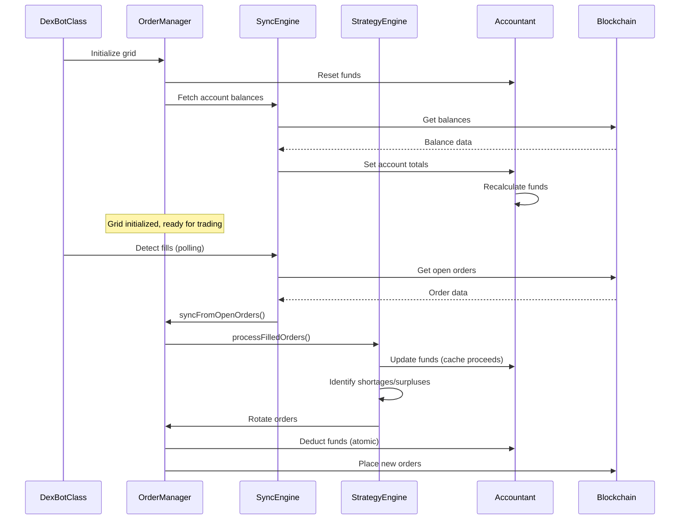

---

## Order State Machine

Orders transition through three primary states during their lifecycle:

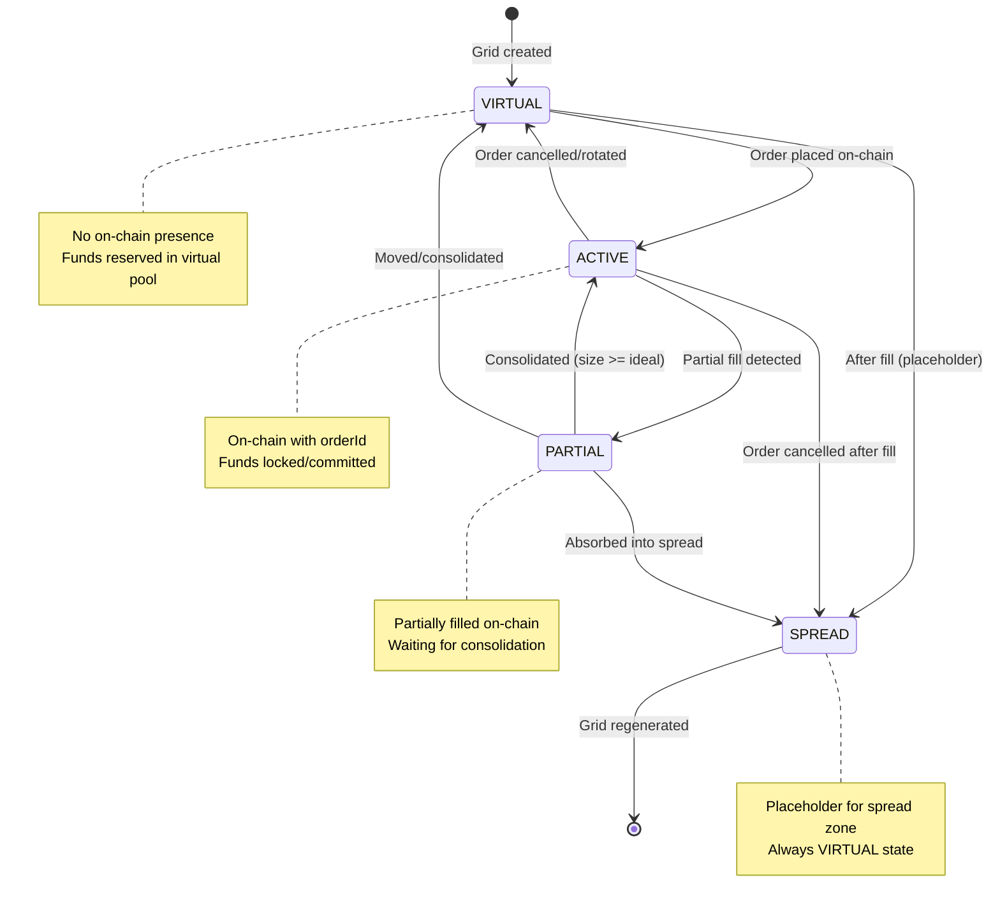

### State Transition Rules

| From State | To State | Trigger | Fund Impact |
|------------|----------|---------|-------------|
| VIRTUAL | ACTIVE | Order placed | Deduct from `chainFree` |
| ACTIVE | PARTIAL | Partial fill | Reduce `committed` by filled amount |
| ACTIVE | VIRTUAL | Order cancelled | Add back to `chainFree` |
| PARTIAL | ACTIVE | Consolidation | Update to `idealSize` (releases dust to `cacheFunds`) |
| PARTIAL | VIRTUAL | Order moved | Release funds, re-reserve |

### Critical: Phantom Order Prevention

A **phantom order** is an illegal state where an order exists as ACTIVE/PARTIAL without a corresponding blockchain `orderId`. This corrupts fund tracking and causes "doubled funds" warnings.

**Why Phantoms Occur**:
1. **Grid Resize Bug**: `Grid._updateOrdersForSide()` could force VIRTUAL → ACTIVE without blockchain confirmation
2. **Sync Gap**: Orders without orderId could remain ACTIVE indefinitely if sync logic skipped them
3. **No Validation**: No centralized check prevented invalid state assignments

**Prevention System** (Three-Layer Defense):

| Layer | Location | Mechanism |
|-------|----------|-----------|
| **Guard** | `manager.js:570-584` | Centralized validation in `_updateOrder()` rejects ACTIVE/PARTIAL without orderId, auto-downgrades to VIRTUAL |
| **Grid Protection** | `grid.js:1154` | Preserve order state during resize: `state: order.state` instead of forcing ACTIVE |
| **Sync Cleanup** | `sync_engine.js:297-305` | Detect orders without orderId and convert to SPREAD placeholders; prevent phantom fills from triggering rebalancing |

**Verification**:
- Direct state assignment in code review: All transitions go through `_updateOrder()` (cannot bypass)
- Automated tests: `tests/repro_phantom_orders.js` confirms all prevention layers work
- Logging: Any phantom creation attempt is logged as ERROR with context

---

## Fund Flow Architecture

The fund tracking system uses atomic operations to prevent race conditions and overdrafts.

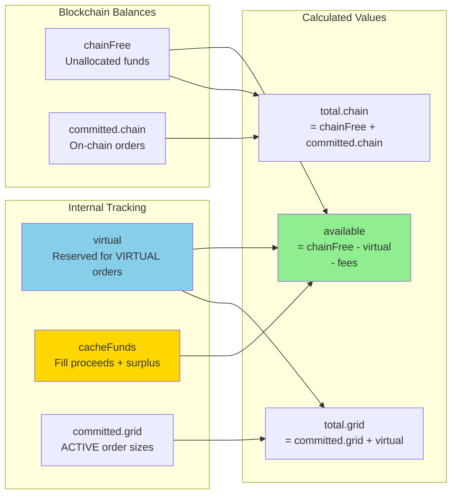

### Fund Components Explained

- **chainFree**: Unallocated funds on blockchain (from `accountTotals.buyFree/sellFree`)
- **committed.chain**: Funds locked in on-chain orders (ACTIVE orders with `orderId`)
- **committed.grid**: Internal tracking of ACTIVE order sizes
- **virtual**: Funds reserved for VIRTUAL orders (not yet on-chain)
- **cacheFunds**: Fill proceeds and rotation surplus (added to sizing calculations)
- **available**: Free funds for new orders = `max(0, chainFree - virtual - cacheFunds - fees)`

### Atomic Fund Operations

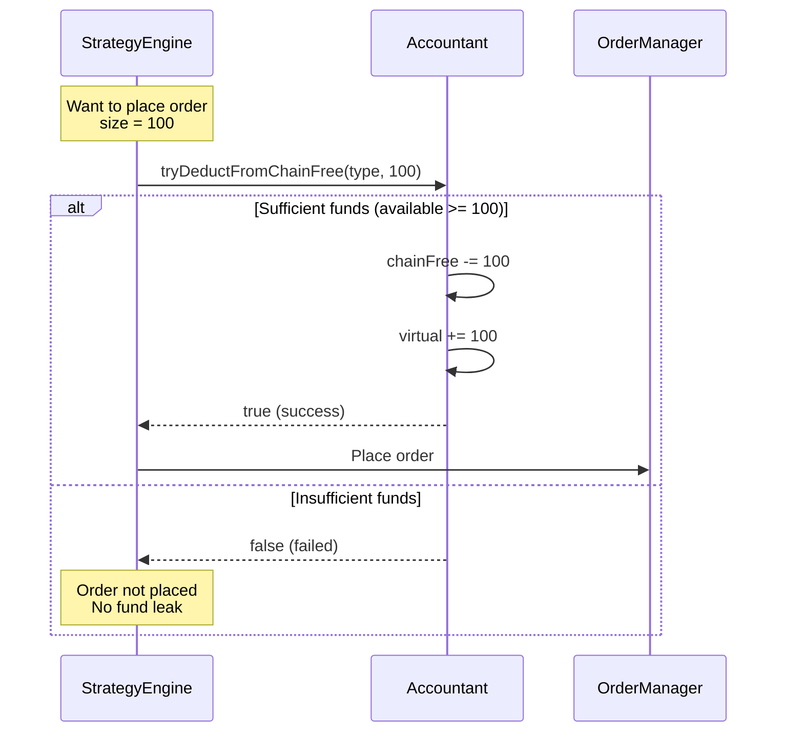

---

## Grid Topology

The grid uses a unified "Master Rail" with a dynamic boundary that shifts as fills occur.

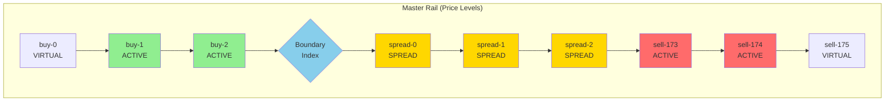

### Boundary Movement

- **Buy Fill**: `boundaryIdx -= 1` (shift left/down)
- **Sell Fill**: `boundaryIdx += 1` (shift right/up)

### Role Assignment

- **BUY**: Slots `[0, boundaryIdx]`
- **SPREAD**: Slots `[boundaryIdx + 1, boundaryIdx + G]` where G = spread gap size (empty slots). Actual gaps = G + 1.
- **SELL**: Slots `[boundaryIdx + G + 1, N]`

---

## Key Operations

### 1. Fill Processing Flow

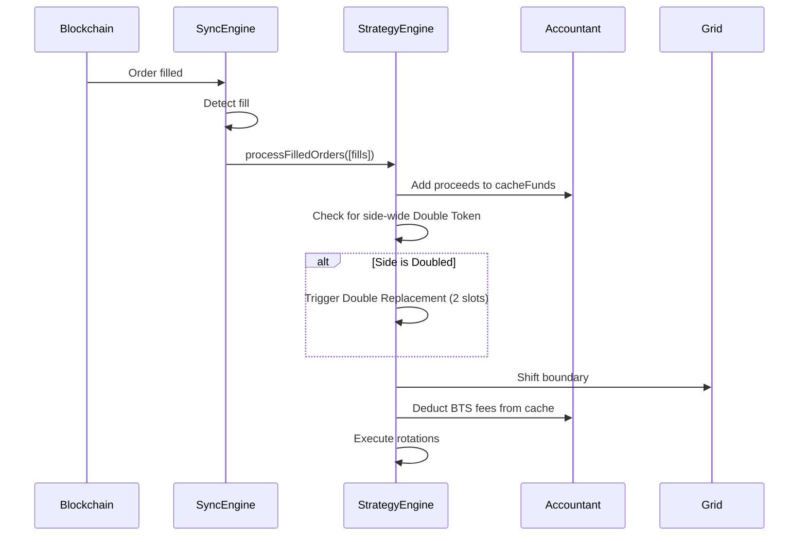

### 2. Order Rotation (Crawl Mechanism)

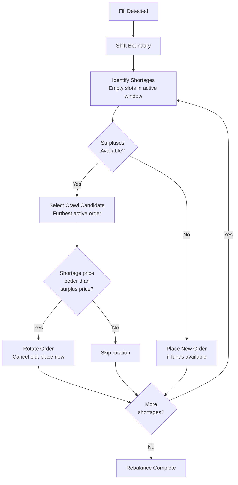

### 3. Grid Divergence Detection

The grid divergence system monitors and corrects misalignment between ideal grid state and persistent blockchain state.

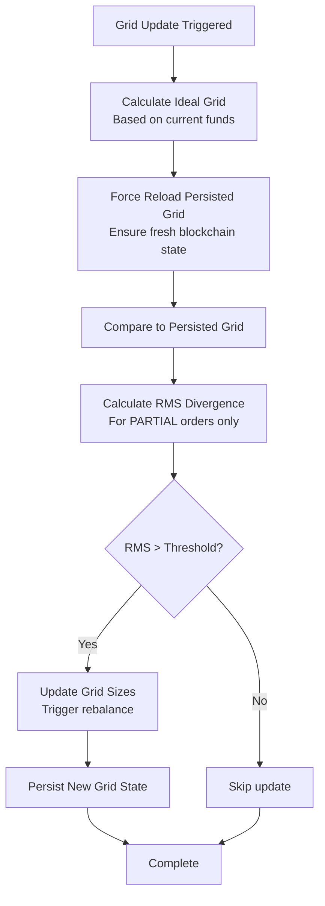

**Key Improvement (v0.6.1)**: Force reload mechanism now ensures fresh persisted grid data before comparison, preventing stale cache from causing false divergence detections.

---

## Concurrency & Locking

The system uses order-level locks to prevent race conditions during async operations.

### Lock Mechanism

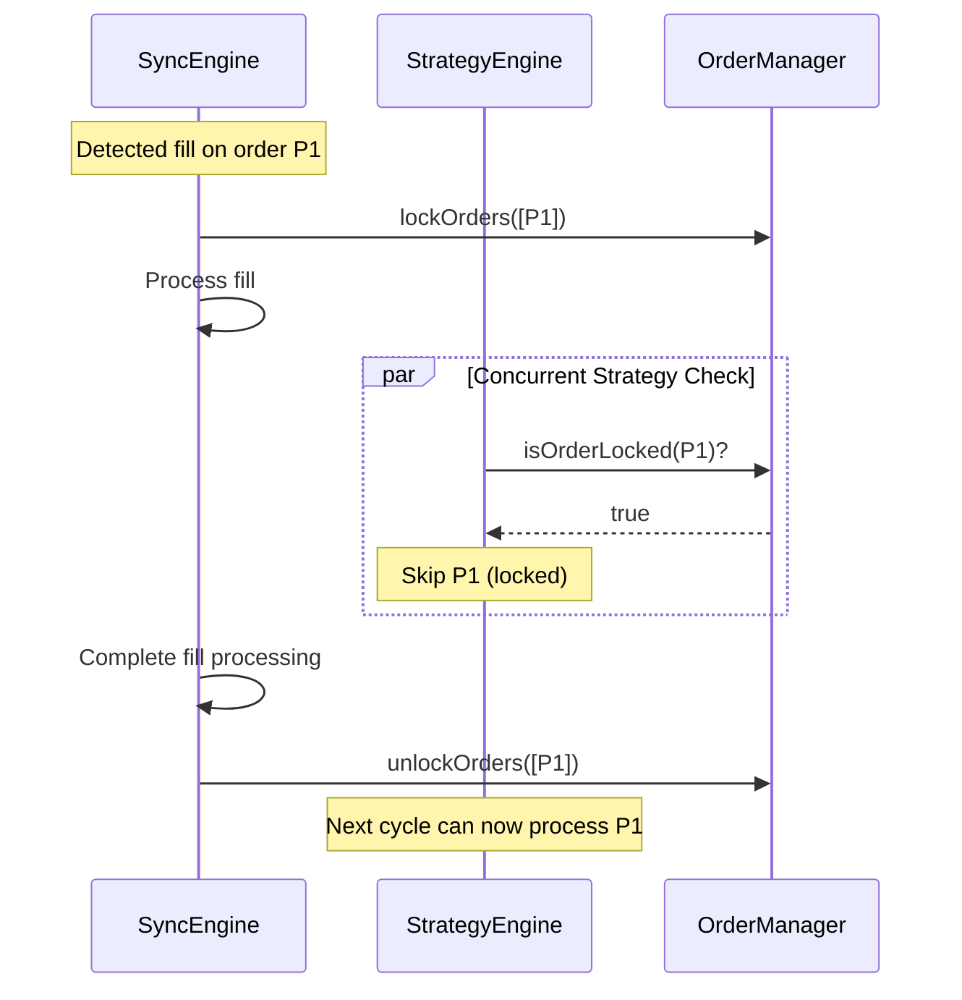

### Lock Lifetime

- **Default timeout**: 5-10 seconds
- **Auto-expiry**: Prevents deadlocks from crashes
- **Best practice**: Always use try/finally to ensure unlock

---

## Module Responsibilities Summary

| Module | Primary Responsibility | Key Functions |
|--------|----------------------|---------------|
| **OrderManager** | Central coordinator, state management | `_updateOrder()`, `lockOrders()`, `getOrdersByTypeAndState()` |
| **Accountant** | Fund tracking, fee management | `recalculateFunds()`, `tryDeductFromChainFree()`, `_verifyFundInvariants()` |
| **StrategyEngine** | Rebalancing, rotation, partial handling | `rebalance()`, `processFilledOrders()`, `preparePartialOrderMove()` |
| **SyncEngine** | Blockchain sync, fill detection | `syncFromOpenOrders()`, `synchronizeWithChain()` |
| **Grid** | Grid creation, sizing, divergence | `createOrderGrid()`, `compareGrids()`, `checkAndUpdateGridIfNeeded()` |
| **Utils** | Shared utilities, conversions | `quantizeFloat()`, `normalizeInt()` (`math.js`); order predicates (`order.js`); COW action building (`validate.js`); price derivation (`system.js`) |
| **Logger** | Formatted logging, diagnostics | `logOrderGrid()`, `logFundsStatus()`, `logGridDiagnostics()` |

---

## Dynamic Configuration Refresh

The bot implementation supports runtime updates to specific configuration parameters without requiring a process restart. This is handled via a **Periodic Configuration Refresh** mechanism.

### The Refresh Cycle

Every 4 hours (default `BLOCKCHAIN_FETCH_INTERVAL_MIN`), the bot performs the following safe refresh cycle:

1.  **Thread-Safe Load**: The bot re-reads `profiles/bots.json` using `readBotsFileWithLock` to ensure it doesn't collide with manual edits or the CLI manager.
2.  **Memory Update**: It identifies its own configuration entry and updates its internal memory state (`this.config` and `manager.config`).
3.  **Non-Disruptive Application**: The refresh is designed to be **passive**. It updates valuation anchors but does **not** trigger on-chain order movement automatically.

### Configuration Authority: `startPrice`

The `startPrice` parameter follows a strict hierarchy of authority:

| Setting Type | Source | Behavior |
|--------------|--------|----------|
| **Numeric** | `bots.json` | **Single Source of Truth**. Blocks all auto-derivation. Used as a fixed anchor for valuation and grid resets. |
| **"pool"** | Blockchain | Derived from current Liquidity Pool price during resets or 4h refresh cycles. |
| **"market"** | Blockchain | Derived from current Orderbook price during resets or 4h refresh cycles. |

---

## Data Persistence

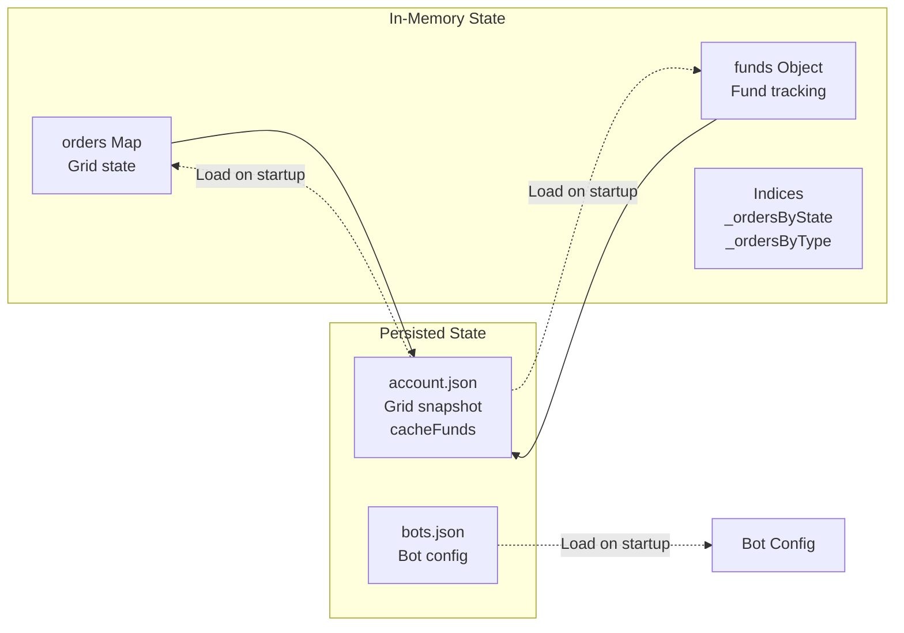

### Persistence Strategy

- **Grid state**: Persisted after every rebalance to `account.json`
- **cacheFunds**: Persisted to survive bot restarts
- **Retry logic**: 3 attempts with exponential backoff
- **Graceful degradation**: Bot continues if persistence fails (in-memory only)

---

## Memory-Only Integer Tracking

The system has been optimized to use a "memory-driven" model for order updates, eliminating redundant blockchain API calls during normal operation.

### Key Changes

**1. Raw Order Cache (`rawOnChain`)**
- Grid slots now store exact blockchain order representations (integers/satoshis) in a `rawOnChain` cache
- **Birth**: Cache populated immediately after successful order placement using broadcasted arguments
- **Partial Fills**: Cache updated in-place via integer subtraction (subtracting filled satoshis from `for_sale`)
- **Updates/Rotations**: Cache refreshed with adjusted integers returned by build process

**2. Eliminated Redundant API Calls**
- Removed all `readOpenOrders()` calls from `_buildSizeUpdateOps()` and `_buildRotationOps()`
- Removed `computeVirtualOpenOrders()` logic that was redundantly fetching entire account state
- The bot now trusts its internal state, backed by real-time fill listener, to build transactions

**3. Refactored `buildUpdateOrderOp()`**
- Updated to support optional `cachedOrder` parameter
- Allows callers to bypass blockchain queries if they have raw state in memory
- Returns `finalInts` along with operation data for local tracking

**4. Self-Healing Resilience**
- Maintains "State Recovery Sync" fallback
- If a memory-driven transaction fails, bot catches error and performs a full refresh
- Ensures internal ledger stays synchronized with BitShares blockchain

### Benefits
- **Faster reaction time**: No waiting for blockchain queries during order updates
- **Reduced API load**: Fewer fetches, less network congestion
- **Mathematical precision**: Integer-based tracking prevents float precision errors
  - *See [FUND_MOVEMENT_AND_ACCOUNTING.md § 5.5](FUND_MOVEMENT_AND_ACCOUNTING.md#55-precision--quantization-patch-14) for quantization utilities and best practices*
- **Fallback safety**: Automatic recovery if memory state becomes inconsistent

### Performance Impact
- Batch operations (size updates, rotations) now run without any blockchain fetches
- Only placement operations and recovery syncs query the blockchain
- Estimated **10-20x speedup** for high-frequency operations

---

## Error Handling & Safety

### Fund Invariants

The system continuously monitors three mathematical invariants:

1. **Account Equality**: `chainTotal = chainFree + committed.chain`
2. **Committed Ceiling**: `committed.grid <= chainTotal`
3. **Available Leak Check**: `available <= chainFree`

**Tolerance**: 0.1% (to account for fees and rounding)

### Index Consistency

- **Validation**: `validateIndices()` checks Map ↔ Set consistency
- **Repair**: `_repairIndices()` rebuilds indices if corruption detected
- **Defensive**: Called after critical operations

---

## Performance Considerations

### Optimization Strategies

1. **Batch fund recalculation**: `pauseFundRecalc()` / `resumeFundRecalc()`
2. **Index-based lookups**: O(1) access via `_ordersByState` and `_ordersByType`
3. **Lock expiry**: Prevents permanent blocking from crashes
4. **Fee caching**: Reduces blockchain API calls

### Metrics Tracking

```javascript
manager.getMetrics()
// Returns:
// - fundRecalcCount
// - invariantViolations
// - lockAcquisitions
// - stateTransitions
// - lastSyncDurationMs
```

---

### Testing Strategy & Quality Assurance

DEXBot2 uses a native Node.js `assert` testing strategy to ensure reliability without heavy dependencies.

### Test Coverage by Module

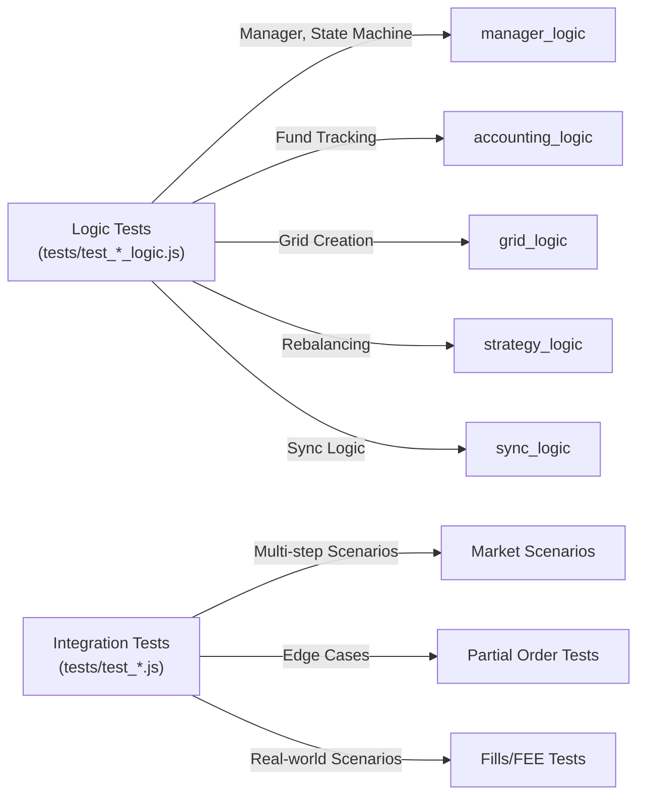

### Running Tests

```bash
# Run all tests (native assert)
npm test

# Specific logic area
node tests/test_accounting_logic.js
```

### Test Quality Metrics

**Coverage Goals:**
- ✅ All public methods have tests
- ✅ All invariants verified automatically
- ✅ Edge cases covered (zero funds, max orders, etc.)
- ✅ Concurrent operations tested with locks
- ✅ State transitions validated end-to-end

**Recent Improvements (2026-01-09):**
- Added 23 new test cases for recent bugfixes
- Created comprehensive strategy engine tests
- Enhanced accounting tests with fee validation
- Added fund precision and delta tests

### Testing Best Practices

**For Developers:**

1. **Run tests before commits**
   ```bash
   npm test
   ```

2. **Add tests for new features**
   - Follow patterns in existing tests
   - Test fund impact of new logic
   - Include edge cases

3. **Verify invariants**
   ```javascript
   expect(manager.validateIndices()).toBe(true);
   expect(chainTotal === chainFree + chainCommitted).toBe(true);
   ```

4. **Use debug mode for problematic scenarios**
   ```javascript
   manager.logger.level = 'debug';  // Enable detailed logging
   // ... run scenario ...
   // Check console output for detailed fund tracking
   ```

### Test Documentation References

- **[TEST_UPDATES_SUMMARY.md](TEST_UPDATES_SUMMARY.md)** - Detailed test coverage for 23 new test cases
  - Maps each test to specific bugfixes
  - Shows what each test validates
  - Running instructions for specific areas

- **[developer_guide.md#testing-fund-calculations](developer_guide.md#testing-fund-calculations)** - Testing guide for developers
  - How to write fund tests
  - Common test patterns
  - Debugging failing tests
  - Adding tests for new features

- **[TESTING_IMPROVEMENTS.md](TESTING_IMPROVEMENTS.md)** - Lessons from bugfix iteration
  - What caused bugs in 0.4.x
  - How tests prevent regressions
  - Design validation checklist

---

## Recent Improvements

### Grid Rebalancing Robustness

The strategy engine has been significantly strengthened with improvements to fund validation, dust handling, and order constraints:

**1. Pre-Flight Fund Validation**
- Before executing batch order placements, available funds are validated
- Prevents insufficient fund errors during large rotation cycles
- Uses atomic check-and-deduct pattern for safety
- Located in: `modules/order/strategy.js` - `rebalanceSideRobust()`

**2. Dust Partial Prevention**
- Improved dust detection algorithm prevents false positives
- Double-creation of dust partials eliminated
- Dust consolidation now happens in single operation
- Detects dust as `< 5% of ideal order size`

**3. Strict Order Size Constraints**
- Orders validated to not exceed available funds
- Maximum order size enforced during both placement and rotation
- Prevents oversized orders that fail on-chain
- Atomic validation with placement ensures consistency

**4. Boundary Index Persistence**
- BoundaryIdx (spread zone pivot) now correctly persisted across bot restarts
- Ensures grid rotation continues seamlessly after divergence correction
- Fixes grid instability from incorrect boundary tracking

**5. Taker Fee Accounting**
- Both market and blockchain taker fees now accounted for correctly
- Fee deduction uses proper `isMaker` parameter
- Prevents fund leaks from missing fee calculations
- Located in: `modules/order/strategy.js` - `processFilledOrders()`

**7. Precision Spread Management (Logarithmic Logic)**
- **Discrete Step Tracking**: Replaced the legacy linear multiplier (`SPREAD_WIDENING_MULTIPLIER`) with a discrete 1-slot logarithmic buffer. This ensures correction triggers exactly when the market moves by one full increment.
- **Center-Gap Awareness**: Refined the grid initialization math to account for the "Center Gap" naturally created during symmetric centering. This reduces the initial spread by ~0.5% (one full increment) compared to the previous version.
- **Collision-Free Safety**: Increased `MIN_SPREAD_FACTOR` to 2.1 to ensure that the security minimum (2 spread orders) never conflicts with the spread correction threshold, even at micro-spread configurations.

### Related Documentation

For detailed fund calculations and test coverage, see:
- [developer_guide.md#testing-fund-calculations](developer_guide.md#testing-fund-calculations) - How fund calculations are tested
- [TEST_UPDATES_SUMMARY.md](TEST_UPDATES_SUMMARY.md) - Detailed coverage of recent bugfix tests

---

- [Fund Movement Logic](FUND_MOVEMENT_AND_ACCOUNTING.md) - Detailed mathematical formulas and algorithms
- [Developer Guide](developer_guide.md) - Code navigation and onboarding
- [README.md](../README.md) - User documentation and setup
- [WORKFLOW.md](WORKFLOW.md) - Git branch workflow

---

## Quick Reference

### Common Code Patterns

**Get orders by state and type:**
```javascript
const activeBuys = manager.getOrdersByTypeAndState(ORDER_TYPES.BUY, ORDER_STATES.ACTIVE);
```

**Atomic fund deduction:**
```javascript
if (manager.accountant.tryDeductFromChainFree(orderType, size)) {
    // Funds deducted, safe to place order
} else {
    // Insufficient funds, skip
}
```

**Batch order updates:**
```javascript
manager.pauseFundRecalc();
for (const order of orders) {
    // context parameter helps with logging/debugging the source of the update
    manager._updateOrder(order, 'batch-update', false, 0);
}
manager.resumeFundRecalc(); // Recalculates once
```

**Lock orders during async operations:**
```javascript
manager.lockOrders([orderId]);
try {
    await asyncOperation();
} finally {
    manager.unlockOrders([orderId]);
}
```
