# DEXBot2 Architecture

This document provides a high-level overview of the DEXBot2 architecture, module relationships, and key data flows.

---

## System Overview

DEXBot2 is a grid trading bot for the BitShares blockchain. It maintains a geometric grid of limit orders that automatically rebalance as the market moves, capturing profit from price oscillations.

### Core Concepts

- **Grid**: A geometric array of price levels with orders placed at each level
- **Spread Zone**: A buffer of empty slots between buy and sell orders
- **Order States**: VIRTUAL (planned) → ACTIVE (on-chain) → PARTIAL (partially filled)
- **Fund Tracking**: Atomic accounting system preventing race conditions and overdrafts

---

## Module Architecture

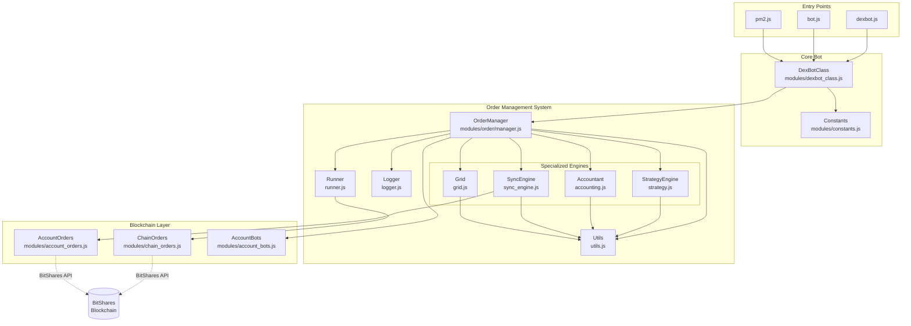

---

## Order Manager: Central Coordinator

The `OrderManager` is the central hub that coordinates all order operations. It delegates specialized tasks to four engine modules:

### Engine Responsibilities

| Engine | File | Responsibility |
|--------|------|----------------|
| **Accountant** | `accounting.js` | Fund tracking, fee management, invariant verification |
| **StrategyEngine** | `strategy.js` | Grid rebalancing, order rotation, partial order handling |
| **SyncEngine** | `sync_engine.js` | Blockchain synchronization, fill detection |
| **Grid** | `grid.js` | Grid creation, sizing, divergence detection |

### Data Flow

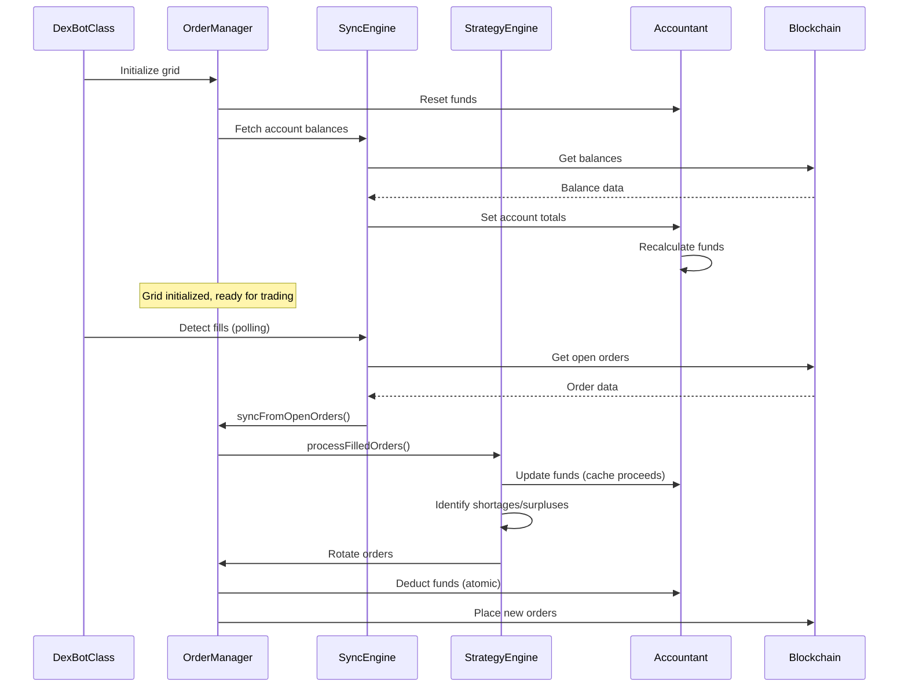

---

## Order State Machine

Orders transition through three primary states during their lifecycle:

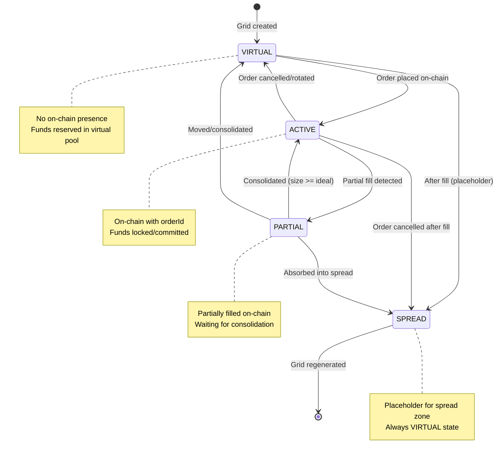

### State Transition Rules

| From State | To State | Trigger | Fund Impact |
|------------|----------|---------|-------------|
| VIRTUAL | ACTIVE | Order placed | Deduct from `chainFree` |
| ACTIVE | PARTIAL | Partial fill | Reduce `committed` by filled amount |
| ACTIVE | VIRTUAL | Order cancelled | Add back to `chainFree` |
| PARTIAL | ACTIVE | Consolidation | Lock additional funds if needed |
| PARTIAL | VIRTUAL | Order moved | Release funds, re-reserve |

---

## Fund Flow Architecture

The fund tracking system uses atomic operations to prevent race conditions and overdrafts.

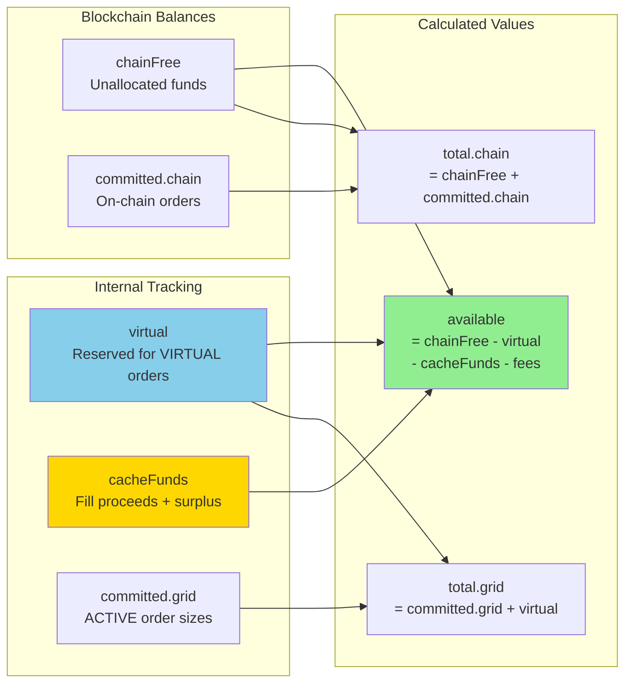

### Fund Components Explained

- **chainFree**: Unallocated funds on blockchain (from `accountTotals.buyFree/sellFree`)
- **committed.chain**: Funds locked in on-chain orders (ACTIVE orders with `orderId`)
- **committed.grid**: Internal tracking of ACTIVE order sizes
- **virtual**: Funds reserved for VIRTUAL orders (not yet on-chain)
- **cacheFunds**: Fill proceeds and rotation surplus (added to sizing calculations)
- **available**: Free funds for new orders = `max(0, chainFree - virtual - cacheFunds - fees)`

### Atomic Fund Operations

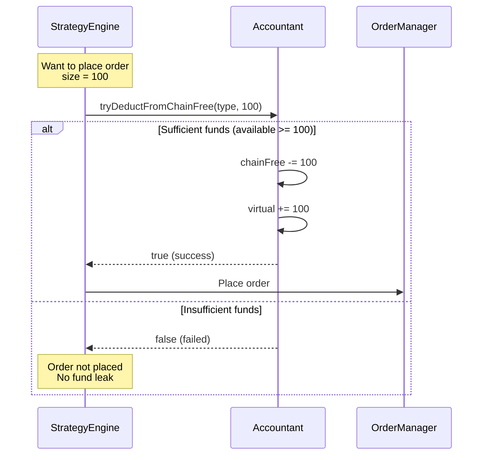

---

## Grid Topology

The grid uses a unified "Master Rail" with a dynamic boundary that shifts as fills occur.

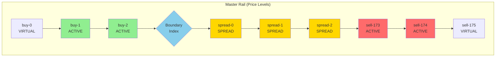

### Boundary Movement

- **Buy Fill**: `boundaryIdx -= 1` (shift left/down)
- **Sell Fill**: `boundaryIdx += 1` (shift right/up)

### Role Assignment

- **BUY**: Slots `[0, boundaryIdx]`
- **SPREAD**: Slots `[boundaryIdx + 1, boundaryIdx + G]` where G = spread gap size
- **SELL**: Slots `[boundaryIdx + G + 1, N]`

---

## Key Operations

### 1. Fill Processing Flow

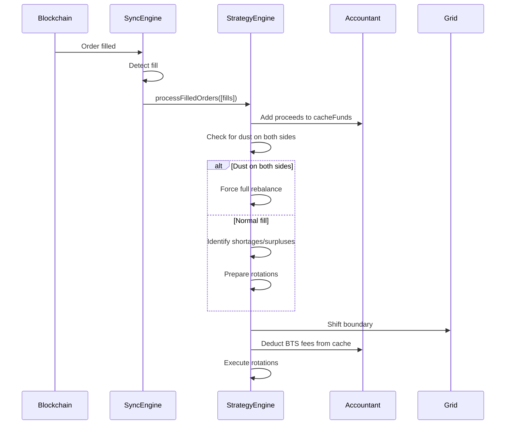

### 2. Order Rotation (Crawl Mechanism)

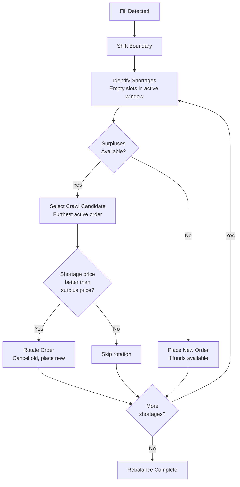

### 3. Grid Divergence Detection

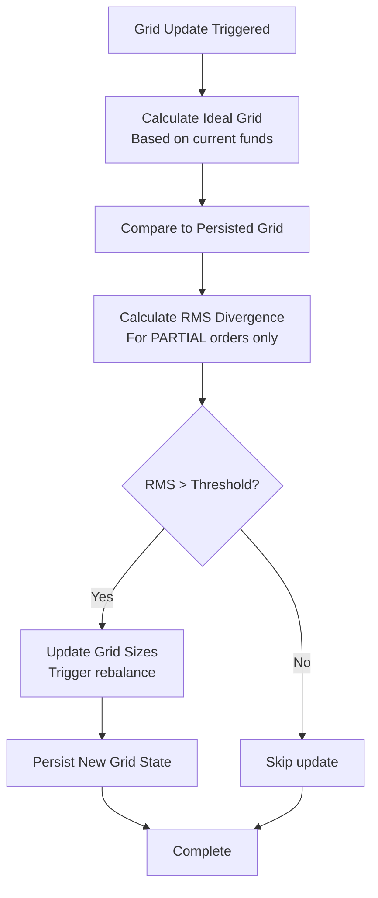

---

## Concurrency & Locking

The system uses order-level locks to prevent race conditions during async operations.

### Lock Mechanism

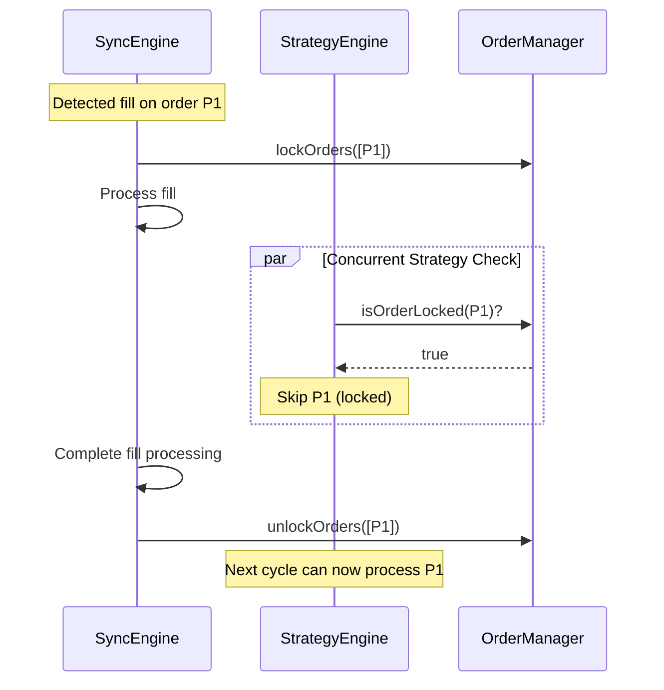

### Lock Lifetime

- **Default timeout**: 5-10 seconds
- **Auto-expiry**: Prevents deadlocks from crashes
- **Best practice**: Always use try/finally to ensure unlock

---

## Module Responsibilities Summary

| Module | Primary Responsibility | Key Functions |
|--------|----------------------|---------------|
| **OrderManager** | Central coordinator, state management | `_updateOrder()`, `lockOrders()`, `getOrdersByTypeAndState()` |
| **Accountant** | Fund tracking, fee management | `recalculateFunds()`, `tryDeductFromChainFree()`, `_verifyFundInvariants()` |
| **StrategyEngine** | Rebalancing, rotation, partial handling | `rebalance()`, `processFilledOrders()`, `preparePartialOrderMove()` |
| **SyncEngine** | Blockchain sync, fill detection | `syncFromOpenOrders()`, `synchronizeWithChain()` |
| **Grid** | Grid creation, sizing, divergence | `createOrderGrid()`, `compareGrids()`, `checkAndUpdateGridIfNeeded()` |
| **Utils** | Shared utilities, conversions | `calculateAvailableFundsValue()`, `floatToBlockchainInt()`, `parseChainOrder()` |
| **Logger** | Formatted logging, diagnostics | `logOrderGrid()`, `logFundsStatus()`, `logGridDiagnostics()` |

---

## Data Persistence

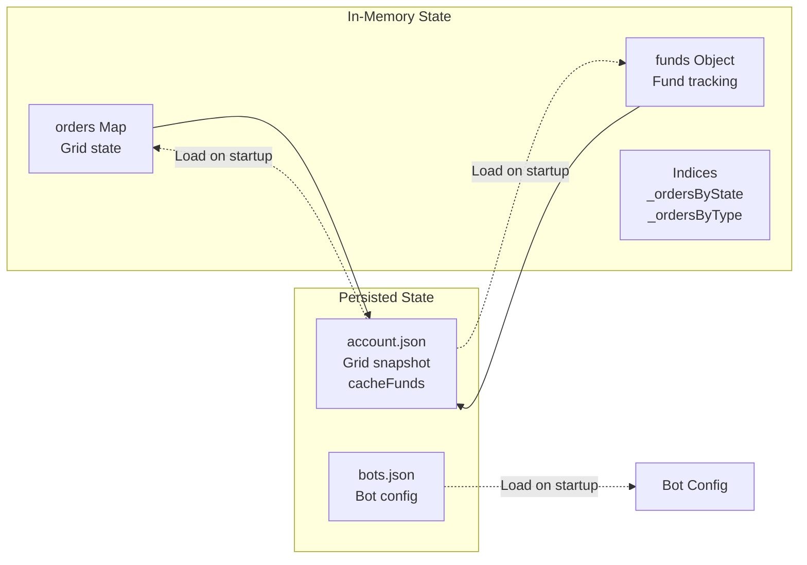

### Persistence Strategy

- **Grid state**: Persisted after every rebalance to `account.json`
- **cacheFunds**: Persisted to survive bot restarts
- **Retry logic**: 3 attempts with exponential backoff
- **Graceful degradation**: Bot continues if persistence fails (in-memory only)

---

## Error Handling & Safety

### Fund Invariants

The system continuously monitors three mathematical invariants:

1. **Account Equality**: `chainTotal = chainFree + committed.chain`
2. **Committed Ceiling**: `committed.grid <= chainTotal`
3. **Available Leak Check**: `available <= chainFree`

**Tolerance**: 0.1% (to account for fees and rounding)

### Index Consistency

- **Validation**: `validateIndices()` checks Map ↔ Set consistency
- **Repair**: `_repairIndices()` rebuilds indices if corruption detected
- **Defensive**: Called after critical operations

---

## Performance Considerations

### Optimization Strategies

1. **Batch fund recalculation**: `pauseFundRecalc()` / `resumeFundRecalc()`
2. **Index-based lookups**: O(1) access via `_ordersByState` and `_ordersByType`
3. **Lock expiry**: Prevents permanent blocking from crashes
4. **Fee caching**: Reduces blockchain API calls

### Metrics Tracking

```javascript
manager.getMetrics()
// Returns:
// - fundRecalcCount
// - invariantViolations
// - lockAcquisitions
// - stateTransitions
// - lastSyncDurationMs
```

---

## Related Documentation

- [Fund Movement Logic](fund_movement_logic.md) - Detailed mathematical formulas and algorithms
- [Developer Guide](developer_guide.md) - Code navigation and onboarding
- [README.md](../README.md) - User documentation and setup
- [WORKFLOW.md](WORKFLOW.md) - Git branch workflow

---

## Quick Reference

### Common Code Patterns

**Get orders by state and type:**
```javascript
const activeBuys = manager.getOrdersByTypeAndState(ORDER_TYPES.BUY, ORDER_STATES.ACTIVE);
```

**Atomic fund deduction:**
```javascript
if (manager.accountant.tryDeductFromChainFree(orderType, size)) {
    // Funds deducted, safe to place order
} else {
    // Insufficient funds, skip
}
```

**Batch order updates:**
```javascript
manager.pauseFundRecalc();
for (const order of orders) {
    manager._updateOrder(order);
}
manager.resumeFundRecalc(); // Recalculates once
```

**Lock orders during async operations:**
```javascript
manager.lockOrders([orderId]);
try {
    await asyncOperation();
} finally {
    manager.unlockOrders([orderId]);
}
```
