# DEXBot2 Architecture

This document provides a high-level overview of the DEXBot2 architecture, module relationships, and key data flows.

> **For practical development guidance**, see [developer_guide.md](developer_guide.md) for quick start, glossary, module deep dive, and common development tasks.

---

## System Overview

DEXBot2 is a grid trading bot for the BitShares blockchain. It maintains a geometric grid of limit orders that automatically rebalance as the market moves, capturing profit from price oscillations.

### Core Concepts

- **Grid**: A geometric array of price levels with orders placed at each level
- **Spread Zone**: A buffer of empty slots between buy and sell orders
- **Order States**: VIRTUAL (planned) → ACTIVE (on-chain) → PARTIAL (partially filled)
- **Fund Tracking**: Atomic accounting system preventing race conditions and overdrafts

---

## Module Architecture

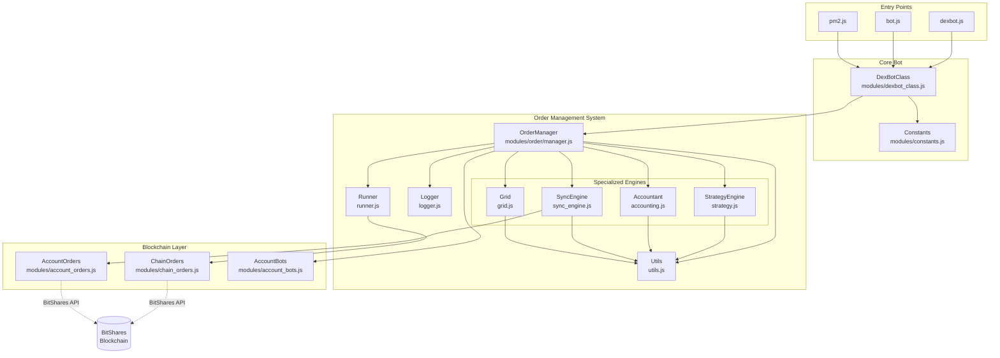

---

## Order Manager: Central Coordinator

The `OrderManager` is the central hub that coordinates all order operations. It delegates specialized tasks to four engine modules:

### Engine Responsibilities

| Engine | File | Responsibility |
|--------|------|----------------|
| **Accountant** | `accounting.js` | Fund tracking, fee management, invariant verification |
| **StrategyEngine** | `strategy.js` | Grid rebalancing, order rotation, partial order handling |
| **SyncEngine** | `sync_engine.js` | Blockchain synchronization, fill detection |
| **Grid** | `grid.js` | Grid creation, sizing, divergence detection |

### Data Flow

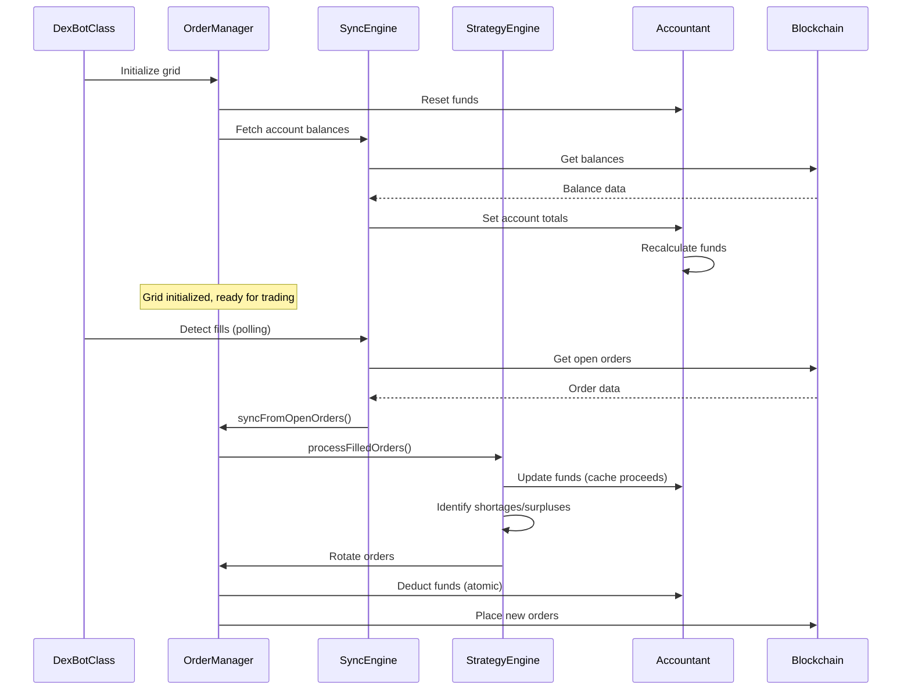

---

## Order State Machine

Orders transition through three primary states during their lifecycle:

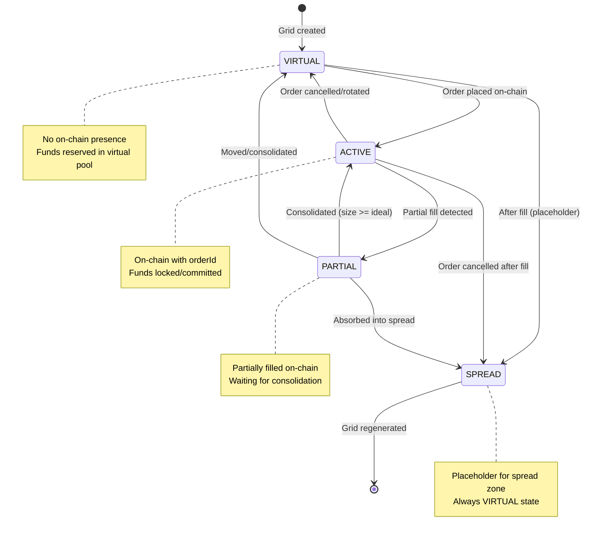

### State Transition Rules

| From State | To State | Trigger | Fund Impact |
|------------|----------|---------|-------------|
| VIRTUAL | ACTIVE | Order placed | Deduct from `chainFree` |
| ACTIVE | PARTIAL | Partial fill | Reduce `committed` by filled amount |
| ACTIVE | VIRTUAL | Order cancelled | Add back to `chainFree` |
| PARTIAL | ACTIVE | Consolidation | Update to `idealSize` (releases dust to `cacheFunds`) |
| PARTIAL | VIRTUAL | Order moved | Release funds, re-reserve |

---

## Fund Flow Architecture

The fund tracking system uses atomic operations to prevent race conditions and overdrafts.

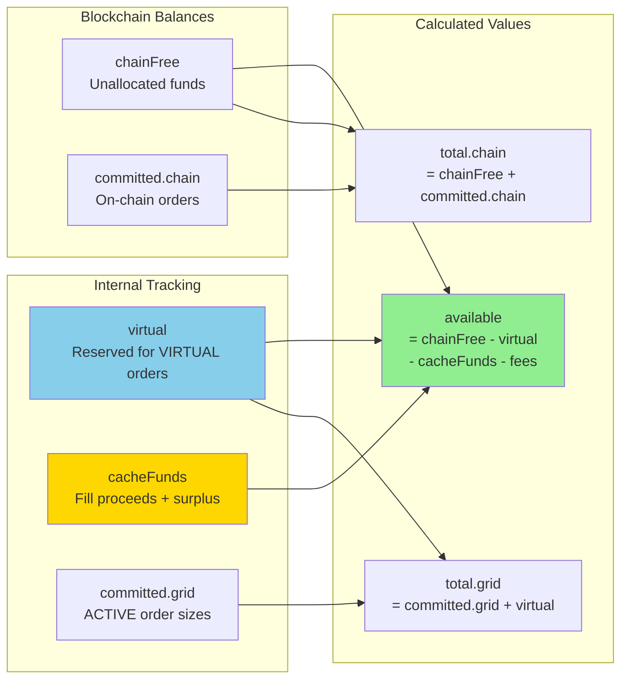

### Fund Components Explained

- **chainFree**: Unallocated funds on blockchain (from `accountTotals.buyFree/sellFree`)
- **committed.chain**: Funds locked in on-chain orders (ACTIVE orders with `orderId`)
- **committed.grid**: Internal tracking of ACTIVE order sizes
- **virtual**: Funds reserved for VIRTUAL orders (not yet on-chain)
- **cacheFunds**: Fill proceeds and rotation surplus (added to sizing calculations)
- **available**: Free funds for new orders = `max(0, chainFree - virtual - cacheFunds - fees)`

### Atomic Fund Operations

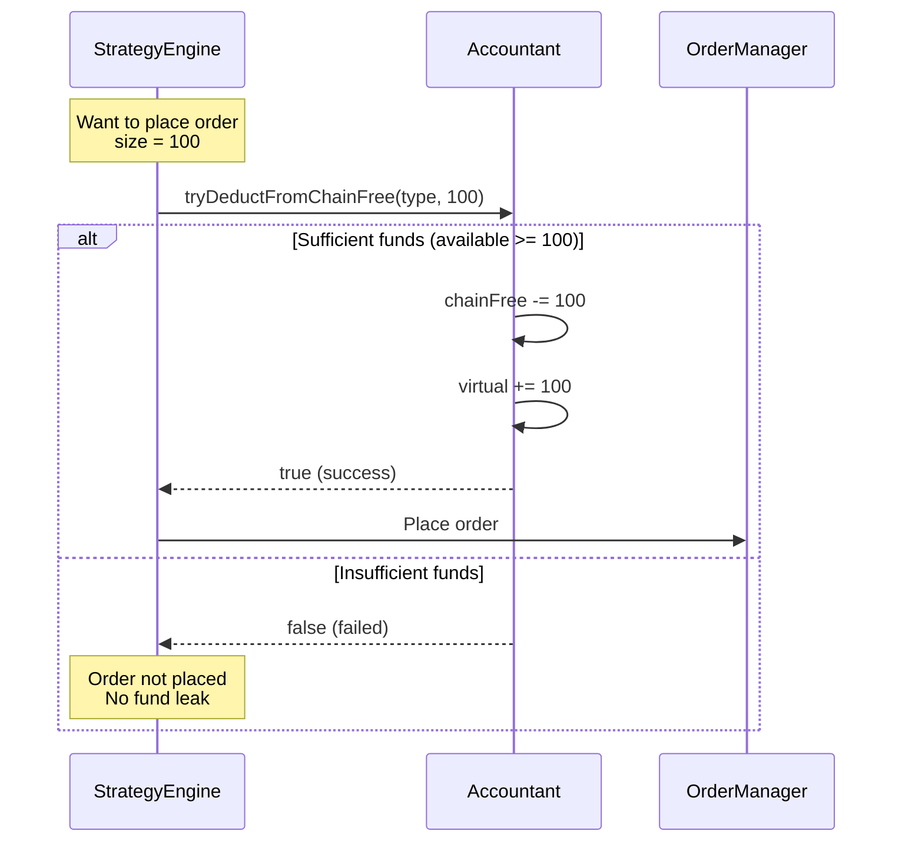

---

## Grid Topology

The grid uses a unified "Master Rail" with a dynamic boundary that shifts as fills occur.

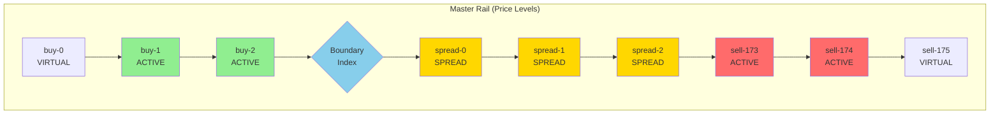

### Boundary Movement

- **Buy Fill**: `boundaryIdx -= 1` (shift left/down)
- **Sell Fill**: `boundaryIdx += 1` (shift right/up)

### Role Assignment

- **BUY**: Slots `[0, boundaryIdx]`
- **SPREAD**: Slots `[boundaryIdx + 1, boundaryIdx + G]` where G = spread gap size
- **SELL**: Slots `[boundaryIdx + G + 1, N]`

---

## Key Operations

### 1. Fill Processing Flow

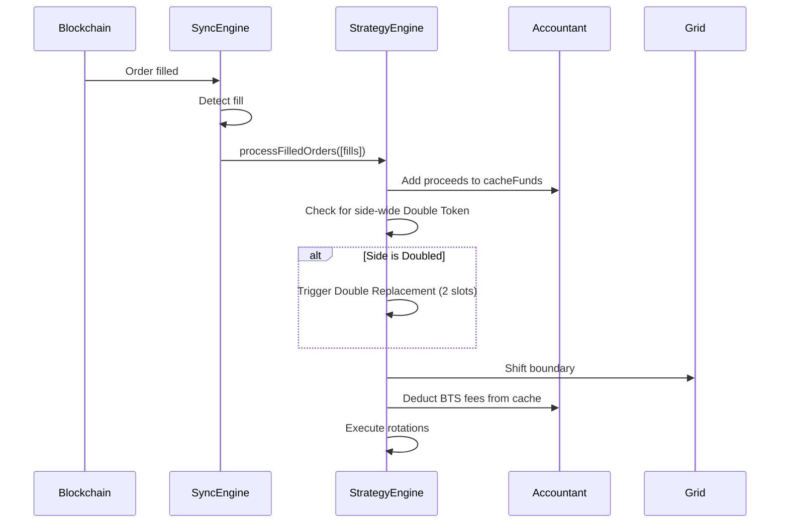

### 2. Order Rotation (Crawl Mechanism)

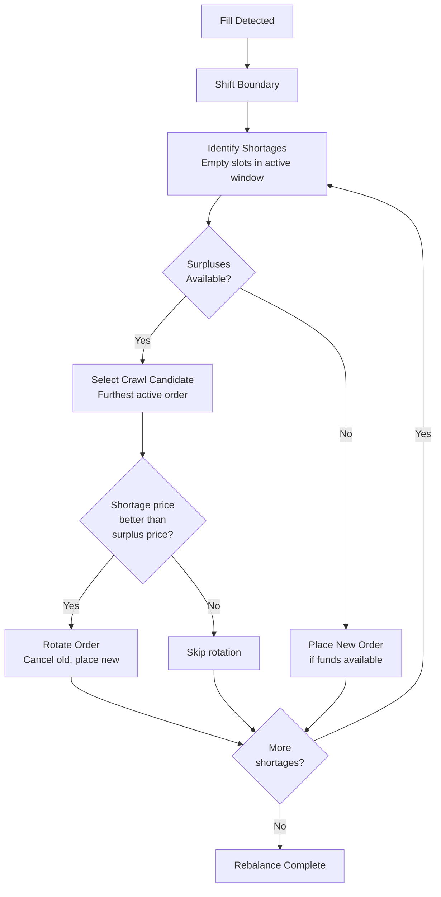

### 3. Grid Divergence Detection

The grid divergence system monitors and corrects misalignment between ideal grid state and persistent blockchain state.

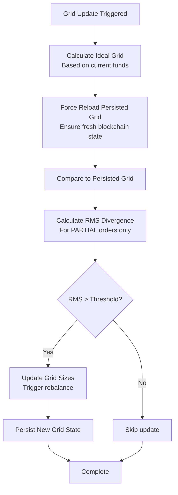

**Key Improvement (v0.6.1)**: Force reload mechanism now ensures fresh persisted grid data before comparison, preventing stale cache from causing false divergence detections.

---

## Concurrency & Locking

The system uses order-level locks to prevent race conditions during async operations.

### Lock Mechanism

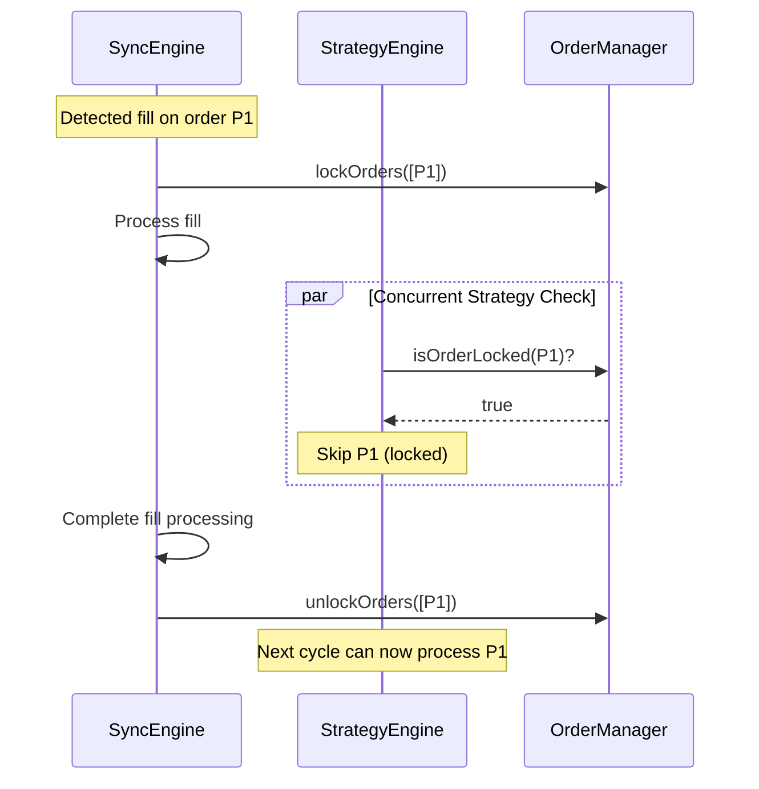

### Lock Lifetime

- **Default timeout**: 5-10 seconds
- **Auto-expiry**: Prevents deadlocks from crashes
- **Best practice**: Always use try/finally to ensure unlock

---

## Module Responsibilities Summary

| Module | Primary Responsibility | Key Functions |
|--------|----------------------|---------------|
| **OrderManager** | Central coordinator, state management | `_updateOrder()`, `lockOrders()`, `getOrdersByTypeAndState()` |
| **Accountant** | Fund tracking, fee management | `recalculateFunds()`, `tryDeductFromChainFree()`, `_verifyFundInvariants()` |
| **StrategyEngine** | Rebalancing, rotation, partial handling | `rebalance()`, `processFilledOrders()`, `preparePartialOrderMove()` |
| **SyncEngine** | Blockchain sync, fill detection | `syncFromOpenOrders()`, `synchronizeWithChain()` |
| **Grid** | Grid creation, sizing, divergence | `createOrderGrid()`, `compareGrids()`, `checkAndUpdateGridIfNeeded()` |
| **Utils** | Shared utilities, conversions | `calculateAvailableFundsValue()`, `floatToBlockchainInt()`, `parseChainOrder()` |
| **Logger** | Formatted logging, diagnostics | `logOrderGrid()`, `logFundsStatus()`, `logGridDiagnostics()` |

---

## Data Persistence

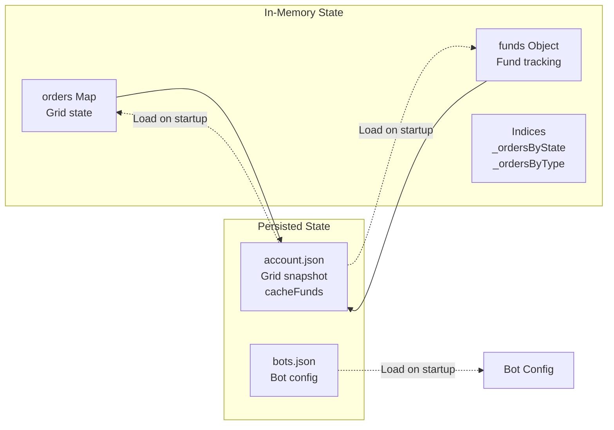

### Persistence Strategy

- **Grid state**: Persisted after every rebalance to `account.json`
- **cacheFunds**: Persisted to survive bot restarts
- **Retry logic**: 3 attempts with exponential backoff
- **Graceful degradation**: Bot continues if persistence fails (in-memory only)

---

## Memory-Only Integer Tracking

The system has been optimized to use a "memory-driven" model for order updates, eliminating redundant blockchain API calls during normal operation.

### Key Changes

**1. Raw Order Cache (`rawOnChain`)**
- Grid slots now store exact blockchain order representations (integers/satoshis) in a `rawOnChain` cache
- **Birth**: Cache populated immediately after successful order placement using broadcasted arguments
- **Partial Fills**: Cache updated in-place via integer subtraction (subtracting filled satoshis from `for_sale`)
- **Updates/Rotations**: Cache refreshed with adjusted integers returned by build process

**2. Eliminated Redundant API Calls**
- Removed all `readOpenOrders()` calls from `_buildSizeUpdateOps()` and `_buildRotationOps()`
- Removed `computeVirtualOpenOrders()` logic that was redundantly fetching entire account state
- The bot now trusts its internal state, backed by real-time fill listener, to build transactions

**3. Refactored `buildUpdateOrderOp()`**
- Updated to support optional `cachedOrder` parameter
- Allows callers to bypass blockchain queries if they have raw state in memory
- Returns `finalInts` along with operation data for local tracking

**4. Self-Healing Resilience**
- Maintains "State Recovery Sync" fallback
- If a memory-driven transaction fails, bot catches error and performs a full refresh
- Ensures internal ledger stays synchronized with BitShares blockchain

### Benefits
- **Faster reaction time**: No waiting for blockchain queries during order updates
- **Reduced API load**: Fewer fetches, less network congestion
- **Mathematical precision**: Integer-based tracking prevents float precision errors
- **Fallback safety**: Automatic recovery if memory state becomes inconsistent

### Performance Impact
- Batch operations (size updates, rotations) now run without any blockchain fetches
- Only placement operations and recovery syncs query the blockchain
- Estimated **10-20x speedup** for high-frequency operations

---

## Error Handling & Safety

### Fund Invariants

The system continuously monitors three mathematical invariants:

1. **Account Equality**: `chainTotal = chainFree + committed.chain`
2. **Committed Ceiling**: `committed.grid <= chainTotal`
3. **Available Leak Check**: `available <= chainFree`

**Tolerance**: 0.1% (to account for fees and rounding)

### Index Consistency

- **Validation**: `validateIndices()` checks Map ↔ Set consistency
- **Repair**: `_repairIndices()` rebuilds indices if corruption detected
- **Defensive**: Called after critical operations

---

## Performance Considerations

### Optimization Strategies

1. **Batch fund recalculation**: `pauseFundRecalc()` / `resumeFundRecalc()`
2. **Index-based lookups**: O(1) access via `_ordersByState` and `_ordersByType`
3. **Lock expiry**: Prevents permanent blocking from crashes
4. **Fee caching**: Reduces blockchain API calls

### Metrics Tracking

```javascript
manager.getMetrics()
// Returns:
// - fundRecalcCount
// - invariantViolations
// - lockAcquisitions
// - stateTransitions
// - lastSyncDurationMs
```

---

## Testing Strategy & Quality Assurance

DEXBot2 employs a comprehensive testing strategy to ensure reliability and prevent regressions in critical fund calculations and rebalancing logic.

### Test Coverage by Module

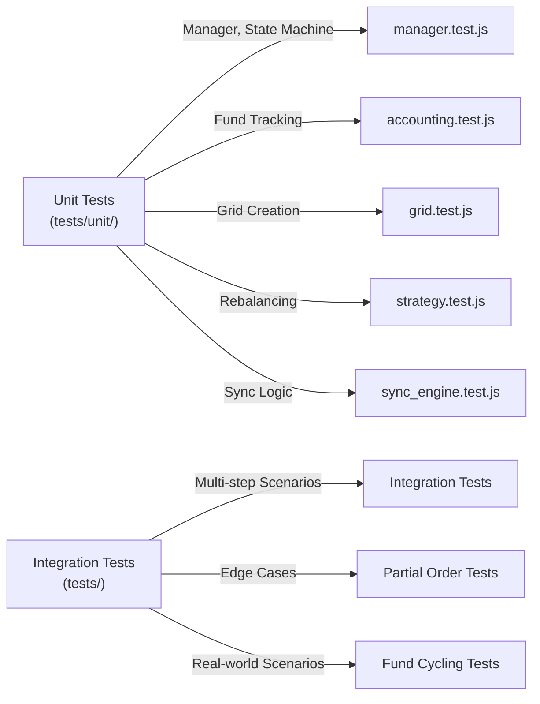

### Test Suite Summary

| Test Type | Files | Test Cases | Coverage |
|-----------|-------|-----------|----------|
| **Unit Tests** | 5 files | 50+ cases | Modules, state transitions |
| **Integration Tests** | 15+ files | 50+ cases | Multi-step scenarios |
| **Fund Snapshot System** | 2 files | Continuous | Automatic auditing |
| **Recent Bugfix Tests** | Updated | 23 cases | Last 10 bugfixes |
| **Total** | 22+ files | 120+ cases | Core functionality |

### Key Test Areas

**1. Fund Accounting (10 test cases)**
```
✓ VIRTUAL fund tracking
✓ ACTIVE/PARTIAL fund transitions
✓ Available pool calculation
✓ CacheFunds deduction
✓ Fund invariant verification
```

**2. Order State Machine (8 test cases)**
```
✓ VIRTUAL → ACTIVE → PARTIAL lifecycle
✓ State transition validation
✓ Index consistency
✓ Order locking mechanisms
✓ Concurrent operation safety
```

**3. Grid Rebalancing (16 test cases)**
```
✓ VIRTUAL order placement capping
✓ PARTIAL order updates
✓ Grid divergence detection
✓ BoundaryIdx persistence
✓ Rotation completion
✓ Taker fee accounting
```

**4. Integration Scenarios (5+ test cases)**
```
✓ Startup after divergence
✓ Fund cycling with fills
✓ Multi-partial rebalancing
✓ Edge-bound grid operations
✓ Cross-namespace movements
```

### Running Tests

```bash
# Run all tests (recommended before commits)
npm test

# Unit tests only
npx jest tests/unit/ --no-coverage

# Specific test file
npx jest tests/unit/accounting.test.js

# Tests matching pattern
npx jest --testNamePattern="fund invariant"

# Watch mode (auto-rerun on changes)
npx jest --watch tests/unit/
```

### Test Quality Metrics

**Coverage Goals:**
- ✅ All public methods have tests
- ✅ All invariants verified automatically
- ✅ Edge cases covered (zero funds, max orders, etc.)
- ✅ Concurrent operations tested with locks
- ✅ State transitions validated end-to-end

**Recent Improvements (2026-01-09):**
- Added 23 new test cases for recent bugfixes
- Created comprehensive strategy engine tests
- Enhanced accounting tests with fee validation
- Added fund precision and delta tests

### Testing Best Practices

**For Developers:**

1. **Run tests before commits**
   ```bash
   npm test
   ```

2. **Add tests for new features**
   - Follow patterns in existing tests
   - Test fund impact of new logic
   - Include edge cases

3. **Verify invariants**
   ```javascript
   expect(manager.validateIndices()).toBe(true);
   expect(chainTotal === chainFree + chainCommitted).toBe(true);
   ```

4. **Use debug mode for problematic scenarios**
   ```javascript
   manager.logger.level = 'debug';  // Enable detailed logging
   // ... run scenario ...
   // Check console output for detailed fund tracking
   ```

### Test Documentation References

- **[TEST_UPDATES_SUMMARY.md](TEST_UPDATES_SUMMARY.md)** - Detailed test coverage for 23 new test cases
  - Maps each test to specific bugfixes
  - Shows what each test validates
  - Running instructions for specific areas

- **[developer_guide.md#testing-fund-calculations](developer_guide.md#testing-fund-calculations)** - Testing guide for developers
  - How to write fund tests
  - Common test patterns
  - Debugging failing tests
  - Adding tests for new features

- **[TESTING_IMPROVEMENTS.md](TESTING_IMPROVEMENTS.md)** - Lessons from bugfix iteration
  - What caused bugs in 0.4.x
  - How tests prevent regressions
  - Design validation checklist

---

## Recent Improvements

### Grid Rebalancing Robustness

The strategy engine has been significantly strengthened with improvements to fund validation, dust handling, and order constraints:

**1. Pre-Flight Fund Validation**
- Before executing batch order placements, available funds are validated
- Prevents insufficient fund errors during large rotation cycles
- Uses atomic check-and-deduct pattern for safety
- Located in: `modules/order/strategy.js` - `rebalanceSideRobust()`

**2. Dust Partial Prevention**
- Improved dust detection algorithm prevents false positives
- Double-creation of dust partials eliminated
- Dust consolidation now happens in single operation
- Detects dust as `< 5% of ideal order size`

**3. Strict Order Size Constraints**
- Orders validated to not exceed available funds
- Maximum order size enforced during both placement and rotation
- Prevents oversized orders that fail on-chain
- Atomic validation with placement ensures consistency

**4. Boundary Index Persistence**
- BoundaryIdx (spread zone pivot) now correctly persisted across bot restarts
- Ensures grid rotation continues seamlessly after divergence correction
- Fixes grid instability from incorrect boundary tracking

**5. Taker Fee Accounting**
- Both market and blockchain taker fees now accounted for correctly
- Fee deduction uses proper `isMaker` parameter
- Prevents fund leaks from missing fee calculations
- Located in: `modules/order/strategy.js` - `processFilledOrders()`

**6. Rotation Completion Logic**
- Rotation now correctly skips over insufficient slots
- Continues to next candidate instead of stalling
- Prevents partial rotations from leaving grid incomplete
- Ensures all eligible orders are rotated per cycle

### Related Documentation

For detailed fund calculations and test coverage, see:
- [developer_guide.md#testing-fund-calculations](developer_guide.md#testing-fund-calculations) - How fund calculations are tested
- [TEST_UPDATES_SUMMARY.md](TEST_UPDATES_SUMMARY.md) - Detailed coverage of recent bugfix tests

---

- [Fund Movement Logic](fund_movement_logic.md) - Detailed mathematical formulas and algorithms
- [Developer Guide](developer_guide.md) - Code navigation and onboarding
- [README.md](../README.md) - User documentation and setup
- [WORKFLOW.md](WORKFLOW.md) - Git branch workflow

---

## Quick Reference

### Common Code Patterns

**Get orders by state and type:**
```javascript
const activeBuys = manager.getOrdersByTypeAndState(ORDER_TYPES.BUY, ORDER_STATES.ACTIVE);
```

**Atomic fund deduction:**
```javascript
if (manager.accountant.tryDeductFromChainFree(orderType, size)) {
    // Funds deducted, safe to place order
} else {
    // Insufficient funds, skip
}
```

**Batch order updates:**
```javascript
manager.pauseFundRecalc();
for (const order of orders) {
    manager._updateOrder(order);
}
manager.resumeFundRecalc(); // Recalculates once
```

**Lock orders during async operations:**
```javascript
manager.lockOrders([orderId]);
try {
    await asyncOperation();
} finally {
    manager.unlockOrders([orderId]);
}
```
